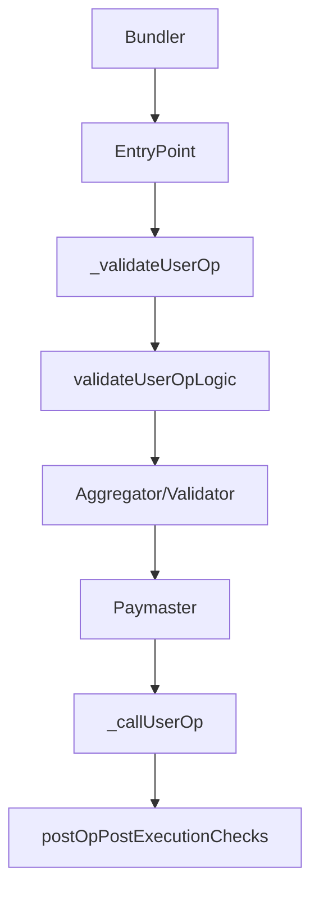
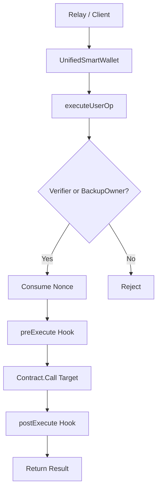
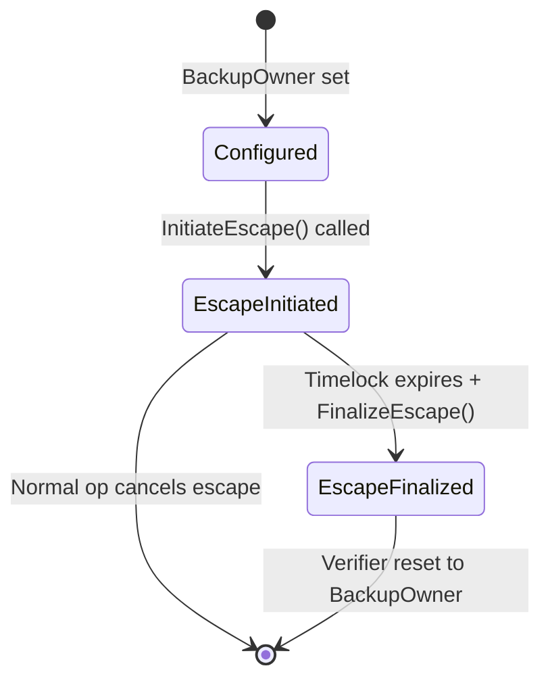

# Ethereum ERC-4337/ERC-7579 vs Neo N3 Abstract Account Comparison

## Executive Summary

This document maps Ethereum ERC-4337 (Account Abstraction) and ERC-7579 (Modular Smart Account) concepts to the Neo N3 Abstract Account implementation. Understanding these mappings helps developers familiar with Ethereum AA adapt to the Neo ecosystem.

---

## 1. Core Concept Mapping

| Ethereum Concept | Neo N3 Equivalent | Implementation Notes |
| --- | --- | --- |
| **EntryPoint Contract** | `UnifiedSmartWallet` | Global singleton contract serving all accounts. No per-account deployment needed. |
| **Smart Account** | Virtual Account (`accountId`) | Deterministic address derived from `verify(accountId)` script, not a deployed contract. |
| **WalletContract** | N/A | Neo uses native `CheckWitness` with `VerifyContext` instead of separate wallet contract. |
| **Paymaster** | Paymaster Integration | Off-chain service sponsoring gas, similar to ERC-4337 paymasters. |
| **Bundler** | Relay Server | Packages `UserOperation`s into Neo transactions. |
| **Aggregator** | MultiHook | Combines multiple validation/policy modules (hooks) into one. |
| **Validator** | Verifier Plugin | Signature verification logic (ECDSA, WebAuthn, TEE, etc.). |
| **Executor** | N/A | Core contract directly executes; no separate executor needed. |
| **Fallback Handler** | `BackupOwner` Native Witness | L1 escape hatch for when verifiers fail. |
| **UserOperation** | `UserOperation` struct | Nearly identical: target, method, args, nonce, deadline, signature. |

---

## 2. UserOperation Structure Comparison

### Ethereum ERC-4337 UserOperation

```solidity
struct UserOperation {
    address sender;
    uint256 nonce;
    bytes initCode;
    bytes callData;
    uint256 callGasLimit;
    uint256 verificationGasLimit;
    uint256 preVerificationGas;
    uint256 maxFeePerGas;
    uint256 maxPriorityFeePerGas;
    bytes paymasterAndData;
}
```

### Neo N3 UserOperation

```csharp
public class UserOperation
{
    public UInt160 TargetContract;  // ~ callData.to
    public string Method;           // ~ callData.selector (full method name)
    public object[] Args;           // ~ callData
    public BigInteger Nonce;         // ~ nonce
    public BigInteger Deadline;        // ~ paymaster.sponsorshipPolicy (time-based expiry)
    public ByteString Signature;       // ~ signature
}
```

**Key Differences:**
- Neo uses `TargetContract + Method + Args` instead of encoded `callData`
- Neo combines gas fields into network/system fee calculated at submission
- Neo uses `Deadline` (absolute timestamp) instead of gas price caps
- Neo excludes `initCode` (no per-account deployment needed)

---

## 3. Validation Flow Comparison

### Ethereum ERC-4337



**Security Properties:**
- Validation and execution in separate calls
- Gas limits enforced per operation
- Paymaster can sponsor or decline
- Aggregators can batch multiple userOps

### Neo N3 Abstract Account



**Security Properties:**
- Single atomic transaction (no pre-validation separate call)
- Verifier called with `CallFlags.ReadOnly` (no state changes)
- Hooks enforce policies around execution
- No per-op gas limits (see security note below)
- Paymaster optional/off-chain

**Critical Difference:** Neo does NOT enforce gas limits on verifier calls. This is a **known vulnerability** - see SECURITY_AUDIT.md.

---

## 4. Nonce Management Comparison

### Ethereum ERC-4337 2D Nonce

- **Sequential Mode:** `nonce = key << 64 + sequence`
  - Channel 0: 0, 1, 2, 3...
  - Channel 1: 0, 1, 2, 3...
- **Used for:** Standard DeFi transactions requiring ordering

### Neo N3 2D Nonce

- **Sequential Mode (nonce < 1,000,000,000,000,000):**
  ```csharp
  BigInteger channel = nonce >> 64;
  BigInteger sequence = nonce & 0xFFFFFFFFFFFFFFFF;
  ```
  - Identical to ERC-4337 semantics
  - Used for: Standard operations

- **Salt/UUID Mode (nonce >= 1,000,000,000,000,000):**
  ```csharp
  byte[] saltKey = Prefix_Nonce + accountId + nonce.ToByteArray();
  ```
  - Used for: High-frequency TEE/SessionKey concurrency
  - Prevents collisions by storing used salts
  - Similar to ERC-4337 proposals for "random nonce mode"

**Mapping:**
- Neo Sequential Mode ≈ ERC-4337 Sequential
- Neo Salt Mode ≈ ERC-4337 EIP-4337 Random/Salted (proposed)

---

## 5. Signature Verification Comparison

### Ethereum ECDSA Signatures

```solidity
// Standard secp256k1 verification
function validateUserOpSignature(UserOperation calldata op, bytes32 hash) external;
```

### Neo N3 Signature Options

| Signature Type | Curve | Use Case | Ethereum Equivalent |
| --- | --- | --- | --- |
| **Native N3** | secp256r1 (Neo native) | Cold wallet backup | N/A |
| **Web3Auth / EIP-712** | secp256k1 | EVM wallet compatibility | EIP-712 Typed Data |
| **WebAuthn / Passkey** | secp256r1 | Hardware biometrics | WebAuthn spec |
| **TEE** | secp256r1 | Trusted execution | BLS/TLS-notary |
| **SessionKey** | secp256r1 | Temporary delegation | Session Keys (EIP-5732) |
| **MultiSig** | Heterogeneous | Threshold approval | Multi-sig wallets |

**Key Advantage:** Neo supports heterogeneous signature schemes (mix EVM + Passkey + TEE) in a single account.

---

## 6. Hook/Policy Comparison

### Ethereum ERC-7579 Modular Smart Account

```solidity
interface IModule {
    function onInstall(bytes32 id) external;
    function onUninstall(bytes32 id) external;
}

interface IValidator {
    function validateUserOp(UserOperation calldata userOp, bytes32 userOpHash)
        external returns (uint256 validationData);
}

interface IExecutor {
    function execute(UserOperation calldata userOp) external;
}

interface IFallback {
    function handleFunctionCall(...) external;
}
```

### Neo N3 Plugins

```csharp
// Verifier (Validator equivalent)
interface IVerifier {
    bool validateSignature(UInt160 accountId, UserOperation op);
    ByteString getPayload(...);
}

// Hook (Policy module equivalent)
interface IHook {
    void preExecute(UInt160 accountId, object[] opParams);
    void postExecute(UInt160 accountId, object[] opParams, object result);
}
```

**Mapping:**
- `IVerifier.validateSignature` ≈ `IValidator.validateUserOp`
- `IHook.preExecute` ≈ Pre-execution validation hook
- `IHook.postExecute` ≈ Post-execution cleanup
- `MultiHook` ≈ ERC-7579 Aggregator

---

## 7. Paymaster/Sponsorship Comparison

### Ethereum ERC-4337 Paymaster

```solidity
interface IPaymaster {
    function validatePaymasterUserOp(UserOperation calldata userOp, bytes32 userOpHash,
        uint256 maxCost) external returns (bytes memory context, uint256 validationData);
}
```

- Validates gas sponsorship
- Returns context for EntryPoint
- Can decline sponsorship

### Neo N3 Paymaster

- **Off-chain service** (Morpheus Paymaster)
- **Authorization endpoint:** `/api/paymaster/authorize`
- **Response:** `{ approved: boolean, reason?: string }`

**Key Differences:**
- Neo paymaster is fully off-chain
- No on-chain paymaster contract required
- Simpler integration but less verifiable on-chain
- Relay server enforces paymaster approval before submission

---

## 8. Recovery/Emergency Access Comparison

### Ethereum Recovery Patterns

1. **Social Recovery:** Multi-sig with guardians
2. **Time-lock:** Delayed admin changes
3. **Oracle Recovery:** On-chain oracle approves lost key
4. **EIP-4337 EntryPoint:** No native recovery (wallet-specific)

### Neo N3 L1 Escape Hatch



**Features:**
- **Timelock:** Configurable 7-90 days
- **Cancel-on-use:** Any normal operation cancels in-progress escape
- **No oracle dependency:** Pure on-chain state machine
- **No per-account deployment:** Works with virtual accounts

**Comparison:** More robust than typical Ethereum AA recovery (which often depends on wallet-specific off-chain mechanisms or complex social recovery smart contracts).

---

## 9. Security Properties Comparison

| Security Property | Ethereum AA | Neo N3 AA | Notes |
| --- | --- | --- | --- |
| **Replay Protection** | ✓ Nonce | ✓ Nonce + Deadline | Both use 2D nonce + expiry |
| **Reentrancy Protection** | ✓ NonReentrant modifier | ✓ ExecutionLock | Both use locks |
| **Cross-chain Replay** | ✓ ChainID in typed data | ✓ `Runtime.GetNetwork()` in payload | Both include network ID |
| **Signature Theft** | ✓ Validator isolation | ✓ Verifier isolation | Both isolate validation |
| **DoS via Gas** | ✓ Gas limits on validation | ✗ **NO GAS LIMITS** | **Neo vulnerability** |
| **Rogue Paymaster** | ✓ Validation returns failure | ✓ Off-chain auth fails | Both can reject |
| **Account Discovery** | ✗ Not specified | ✓ Reverse indices | Neo advantage |
| **Batch Operations** | ✓ UserOp[] | ✓ UserOperation[] | Both support batches |
| **Verification Context** | ✓ Sender, paymaster | ✓ accountId, contract | Similar surface |

---

## 10. Migration Guide for Ethereum AA Developers

### From Ethereum EntryPoint to Neo UnifiedSmartWallet

| Concept | How to Adapt |
| --- | --- |
| **Deploying new account** | Use `RegisterAccount()` instead of deploying a proxy. Account address is deterministic. |
| **Sending UserOperation** | Call `executeUserOp(accountId, op)` instead of `handleUserOps()`. |
| **Paymaster integration** | Implement off-chain auth endpoint instead of on-chain `validatePaymasterUserOp()`. |
| **Aggregator pattern** | Use `MultiHook` to combine policy modules. |
| **Bundler integration** | Implement relay server that calls `simulateMetaInvocation()` then `relayMetaInvocation()`. |
| **Signature schemes** | Use `Web3AuthVerifier` for EVM sigs, `WebAuthnVerifier` for passkeys. |
| **Recovery** | Use `InitiateEscape()` / `FinalizeEscape()` for L1 backup. |

### Code Pattern: Ethereum AA → Neo AA

**Ethereum:**
```solidity
UserOp[] calldata ops;
entryPoint.handleOps(ops, beneficiary);
```

**Neo:**
```csharp
UserOperation[] ops;
object[] results = ExecuteUserOps(accountId, ops);
// Or via SDK/relay:
relayMetaInvocation({ scriptHash: aaContract, operation: "executeUserOps", args: [accountId, ops] });
```

---

## 11. Known Limitations vs Ethereum AA

1. **No On-Chain Paymaster Contract:** Paymaster decisions are off-chain only.
2. **No Verifier Gas Limits:** Malicious verifiers can DoS operations (critical).
3. **Simpler Fee Model:** No per-op gas estimation hooks.
4. **No Staking/Sponsored Paymasters:** Paymaster must be pre-funded (no staking).
5. **Limited Aggregation:** `MultiHook` doesn't aggregate signatures like Ethereum aggregators.

---

## 12. Neo N3 Advantages vs Ethereum AA

1. **Zero-Deployment Virtual Accounts:** No gas cost for account creation.
2. **Heterogeneous Signature Support:** Mix EVM, Passkey, TEE in one account.
3. **L1 Native Escape:** Robust recovery without complex social recovery.
4. **Account Discovery:** Reverse indices for O(1) account lookup.
5. **Unified Execution Context:** Single contract for all accounts simplifies indexing.
6. **TEE-First Design:** Built for trusted execution environments.
