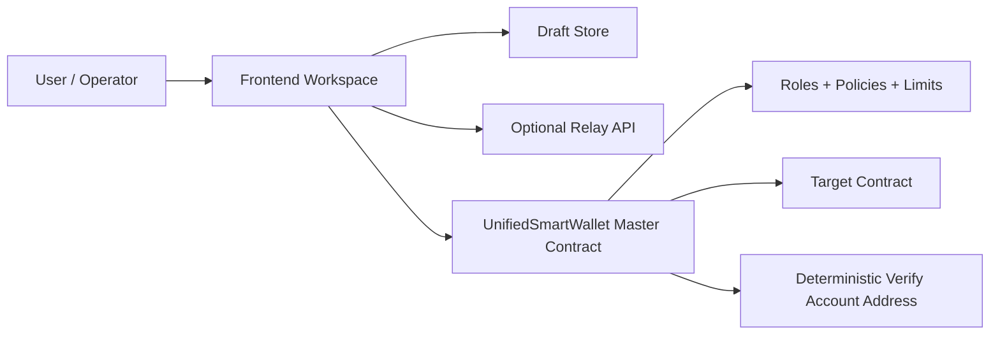
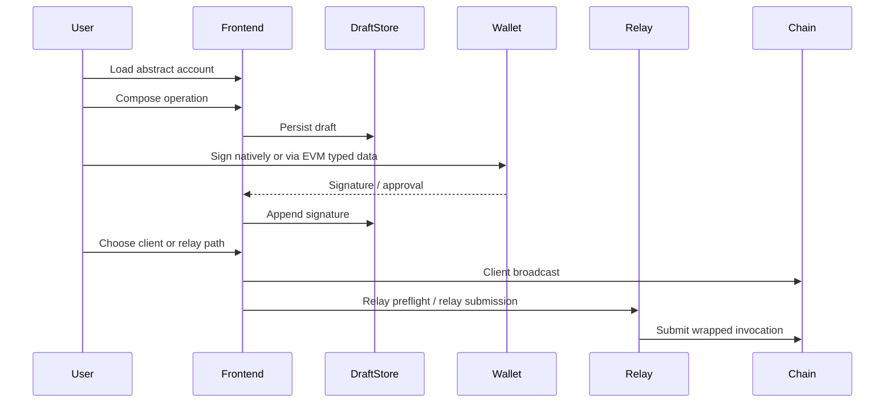

# How It Works & Usage Guide

This guide explains the Neo Abstract Account system end to end: what the contract does, how the website is organized, how a user creates and uses an account, how collaboration drafts work, and how transactions finally reach the chain.

## 1. Who This Is For

Use this page if you are trying to answer any of these questions:

- **New user:** What is an Abstract Account and what do I click first?
- **Signer:** What can I review and sign without taking operator actions?
- **Operator:** How do I collect approvals, run relay checks, and submit safely?
- **Integrator:** Which parts are on-chain, off-chain, and server-side?

If you only want one mental model, use this:

> One global AA contract stores account configuration, while each logical account gets a deterministic verify address that routes authorization back through the shared policy-gated engine.

## 2. Mental Model

An Abstract Account in this project is **not** a new smart contract deployed per user.

Instead, the system uses one global master contract plus a deterministic verification account address for each logical account.

The result is:

- one shared on-chain execution engine
- zero per-account deployment cost
- isolated account configuration per `accountId`
- support for both native Neo signatures and EVM EIP-712 signatures
- one consistent permission surface for native calls, relay-assisted calls, and meta-transactions

### Account Discovery and Batch Operations

The system includes efficient account discovery through reverse indices:

- **Role-based queries:** Find all accounts where an address is admin or manager via `GetAccountsByAdmin` and `GetAccountsByManager`
- **O(1) lookups:** Reverse indices provide constant-time account discovery without scanning
- **Batch creation:** Deploy multiple accounts with shared governance in a single transaction via `CreateAccountBatch`
- **Creator defaults:** Transaction sender automatically becomes default admin when creating accounts

This enables:
- Portfolio management: users can query all accounts they control
- Organizational oversight: admins can discover accounts under their authority
- Efficient onboarding: create multiple accounts for teams or projects in one operation

## 3. Choose the Right Path

Use the path that matches your role and risk profile:

| Situation | Recommended path | Why |
| --- | --- | --- |
| One user, one browser, ready to submit | Client-side broadcast | Simplest and safest default path. |
| Shared review and signature collection | Draft + collaborator link | Lets signers review and approve without operator powers. |
| Relay simulation before submit | Operator link + relay preflight | Shows VM state, gas, and payload details before final submission. |
| EVM wallet approval flow | Meta signature + relay-ready invocation | Keeps EIP-712 signing while preserving Neo policy enforcement. |
| No Supabase configured | Local-only draft flow | Compose, save, and sign in the same browser without cross-device sharing. |

## 4. What the System Contains

Think of the full product as four connected surfaces:

1. **On-chain engine** — the master contract plus deterministic verify path
2. **Frontend workspace** — compose, review, sign, and broadcast UI
3. **Collaboration storage** — immutable draft body plus append-only signatures/activity
4. **Optional server helpers** — relay submission and signed operator mutations

Those surfaces are connected, but they do not all have the same authority. Supabase does not replace the contract permission model, and a shared URL does not by itself bypass operator-only actions.

## 5. What Happens During One Transaction?

Most users interact through the home workspace:

The key design choice is that the downstream target contract is **not** called directly by a raw proxy-signed transaction. Instead, execution routes through AA wrapper entrypoints such as `executeUnifiedByAddress` or `executeUnifiedByAddress`, where the policy engine can enforce role checks, whitelists, blacklists, and transfer limits.

## 6. Draft Collaboration Model

The website uses a three-scope draft model:

- **Share link** — read-only review
- **Collaborator link** — signature collection only
- **Operator link** — relay checks, broadcast, receipt updates, and link rotation

That means:

- people reviewing a draft cannot mutate it
- signers cannot impersonate operators
- operators can rotate write-capable links if one leaks
- operator actions still pass through the signed server-side mutation path when configured

## 7. Human-Readable Domain Access

The frontend can use `.matrix` domains as a discovery layer. During account creation, a compatible Neo wallet can submit a single batched transaction that both creates the AA and registers the `.matrix` domain to the signer wallet. Later, the frontend resolves the domain back to the controller wallet address and discovers associated AA addresses through on-chain admin/manager indexes.

## 8. How a User Uses the Website

### For a new user

1. Open **Home**
2. Load or derive the abstract account
3. Choose an operation preset or create a custom invocation
4. Persist the draft
5. Share links depending on the collaborator role
6. Collect approvals
7. Run relay checks if needed
8. Broadcast through a wallet or relay

### For a signer

1. Open the collaborator link
2. Review the draft and operation snapshot
3. Add a manual signature or an EVM typed-data approval
4. Leave relay/broadcast tasks to the operator

### For an operator

1. Open the operator link
2. Monitor signatures and relay readiness
3. Run preflight checks
4. Broadcast client-side or via relay
5. Rotate collaborator or operator links when needed

### For a developer or auditor

1. Read the **Core Architecture** page for contract structure
2. Read the **Workflow Lifecycle** page for execution sequences
3. Read the **Data Flow & Storage** page for boundary ownership
4. Read **SDK Integration** for runtime and relay configuration

## 9. What Gets Stored Where?

The draft body and collaboration state live off-chain, while authority and execution rules live on-chain.

- **On-chain:** admins, managers, thresholds, verifier configuration, whitelist / blacklist rules, dome settings, and transfer limits
- **Browser / Supabase:** immutable draft body, collected signatures, activity timeline, relay preflight snapshots, and bounded submission receipt history
- **Relay server:** simulation, raw transaction forwarding if explicitly enabled, and meta invocation submission when a relay signer is configured

Shared draft metadata is intentionally bounded: the frontend retains only the latest **100 activity entries** and the latest **12 submission receipts** so collaboration records stay lightweight over time.

## 10. Key Security Boundaries

Every execution path still flows through the same protection layer:

- account existence checks
- role / threshold verification
- optional custom verifier hook
- dome timeout + oracle unlock path
- method allowlist
- blacklist / whitelist
- max transfer restrictions

The practical security result is:

- deterministic proxy witnesses are limited to hardened AA wrapper flows
- public links are read-only
- collaborator links are signature-only
- operator actions use signed server-side mutations
- direct proxy-signed external spends remain invalid

## 11. Recommended Reading Order

If you are learning the system for the first time, read these pages in order:

1. **How It Works & Usage Guide**
2. **Core Architecture**
3. **Workflow Lifecycle**
4. **Data Flow & Storage**
5. **SDK Integration**

## 12. Glossary

- **Abstract Account** — a logical account identified by an `accountId`, enforced by the shared AA contract
- **Deterministic account address** — the Neo address derived from the `verify(accountId)` script
- **Master contract** — the shared on-chain execution and permission engine
- **Draft** — the off-chain collaboration record containing operation data, signatures, and metadata
- **Collaborator link** — a scoped link for signature collection only
- **Operator link** — a scoped link for relay, broadcast, receipts, and link rotation
- **Relay preflight** — a server-backed simulation of a relay-ready invocation before submission
- **Meta invocation** — the AA wrapper payload created from EVM typed-data signatures
- **Account discovery** — querying all accounts where an address holds admin or manager roles via reverse indices
- **Batch creation** — creating multiple accounts with shared governance configuration in a single transaction
- **Reverse index** — on-chain storage mapping addresses to their associated account IDs for O(1) role-based queries
