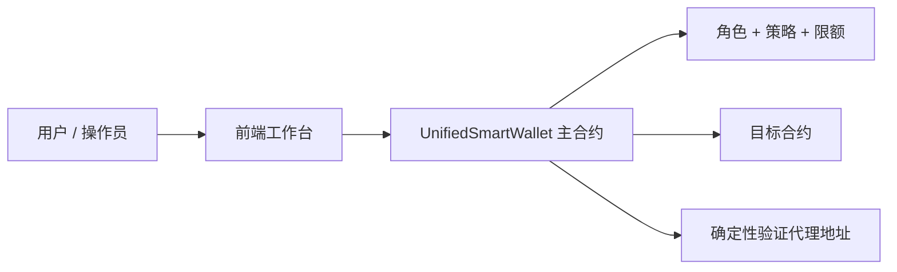
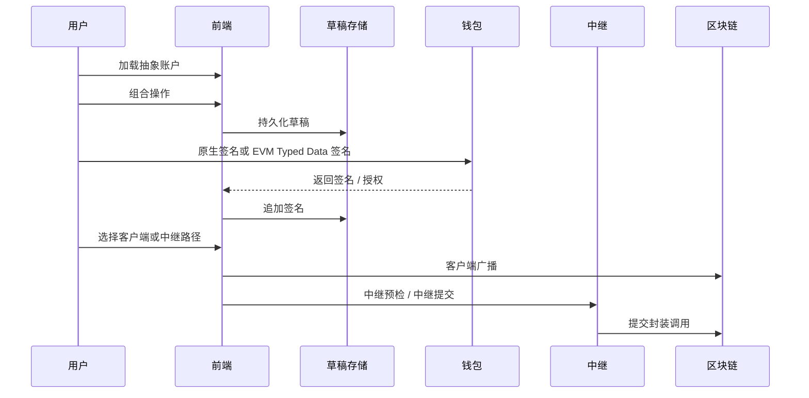
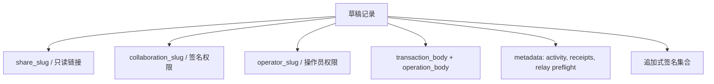

# 工作原理与使用指南

本指南会从整体上解释 Neo 抽象账户系统：合约在做什么、网站如何组织、用户如何创建和使用账户、协作草稿如何工作，以及交易最终如何到链上。

## 1. 核心理解

本项目中的抽象账户**不是**为每个用户单独部署一个新合约。

系统采用的是：一个全局主合约 + 针对每个逻辑账户派生出的确定性验证代理地址。

因此系统具备以下特点：

- 所有账户共用同一套链上执行引擎
- 无需为每个账户单独部署合约，降低成本
- 通过 `accountId` 隔离每个账户的配置与状态
- 同时支持原生 Neo 签名与 EVM EIP-712 签名
- 所有执行路径（原生调用、中继辅助调用、元交易）共用一套统一的权限校验层
- 可选的链上 Paymaster，实现无需信任的赞助/无 GAS 执行

## 2. 选择合适的路径

根据你的角色和风险偏好选择合适的路径：

| 场景 | 推荐路径 | 原因 |
| --- | --- | --- |
| 一个用户、一个浏览器、直接提交 | 客户端广播 | 最简单、最安全的默认路径。 |
| 共享审查与签名收集 | 草稿 + 协作者链接 | 允许签名者在无操作员权限的情况下审查和批准。 |
| 无 GAS / 赞助交易 | 链上 Paymaster + 中继 | 赞助商存入 GAS，中继提交后原子性获得报销。 |
| 提交前中继模拟 | 操作员链接 + 中继预检 | 在最终提交前展示 VM 状态、GAS 消耗和载荷细节。 |
| EVM 钱包审批流 | 元签名 + 中继就绪调用 | 保留 EIP-712 签名的同时实施 Neo 策略检查。 |
| 未配置 Supabase | 仅本地草稿流 | 在同一浏览器中创建、保存和签名，无需跨设备共享。 |

## 3. 链上架构分层

智能合约大体分成以下几层：

1. **账户生命周期** —— 创建账户、绑定确定性地址
2. **存储与上下文** —— 规范化存储键，管理执行锁与临时验证上下文
3. **执行与权限** —— 鉴权并执行白名单 / 黑名单 / 限额检查
4. **元交易** —— 恢复 EVM 签名者，并接入同一权限引擎
5. **管理与策略** —— 角色、阈值、验证器、Dome、限额等配置
6. **Oracle / Dome** —— 非活跃恢复路径
7. **升级** —— 仅部署者可执行的升级入口

## 4. 用户工作流

大多数用户都通过首页工作台完成操作：

## 5. 草稿协作模型

网站现在采用三层草稿权限模型：

- **分享链接** —— 只读查看
- **协作者链接** —— 仅用于收集签名
- **操作员链接** —— 中继预检、广播、回执写入、链接轮换

这意味着查看者不能修改草稿，签名者不能冒充操作员，而操作员在链接泄露时可以轮换写权限链接。

## 6. 交易路径

### 客户端路径

浏览器钱包直接签名并广播经过 AA 包装后的调用。

### 中继路径

前端会准备“已签名原始交易”或“中继就绪的元调用”。中继服务可以先模拟执行，再在配置完成后真正提交交易。

## 7. 执行前的策略检查

所有执行路径都会经过同一套保护逻辑：

- 账户是否存在
- 角色 / 阈值鉴权
- 可选的自定义验证器
- Dome 超时 + Oracle 解锁
- 方法白名单
- 黑名单 / 白名单
- 最大转账限额

## 8. 前端与 Supabase 的数据流

Supabase 保存的是协作草稿状态，而不是链上核心授权规则。

操作员级别的动作通过服务端签名变更路径执行，因此即使操作员链接泄露，也不足以单独完成广播或链接轮换。

## 9. 用户如何使用网站

### 新用户

1. 打开 **首页**
2. 加载或派生抽象账户
3. 选择预设操作或自定义调用
4. 持久化草稿
5. 根据协作角色分享不同链接
6. 收集签名
7. 如有需要运行中继预检
8. 通过钱包或中继完成广播

### 签名者

1. 打开协作者链接
2. 查看草稿与操作快照
3. 添加手动签名或 EVM typed-data 授权
4. 将中继与广播交给操作员处理

### 操作员

1. 打开操作员链接
2. 监控签名进度与中继就绪状态
3. 运行预检
4. 通过客户端或中继完成广播
5. 在必要时轮换协作者或操作员链接

## 10. 赞助 / 无 GAS 交易

链上 `AAPaymaster` 合约使用户无需持有 GAS 即可执行操作：

1. **赞助商**（dApp、组织或服务）将 GAS 存入 Paymaster 合约，并创建赞助策略，指定要资助的账户、合约、方法和预算。
2. **中继**调用 AA 核心的 `executeSponsoredUserOp`，附带赞助商和 Paymaster 的详细信息。
3. AA 核心预验证策略（快速失败），正常执行 UserOp（验证器 + 钩子），然后原子性结算报销 —— 从赞助商存款中扣除并将 GAS 发送给中继。

赞助商可以创建**针对特定账户的策略**（指定 accountId）或**全局策略**（accountId = Zero）来赞助任意账户。策略支持：
- 每笔操作 GAS 上限
- 每日花费预算（24 小时滚动窗口）
- 总生命周期预算
- 目标合约与方法限制
- 过期时间戳

Paymaster 不会替代验证器或备份所有者 —— 它只在操作已完全授权后为中继提供资金。

## 11. 推荐阅读顺序

如果你是第一次接触这个系统，建议按以下顺序阅读：

1. **工作原理与使用指南**
2. **核心架构**
3. **工作流生命周期**
4. **数据流与存储**
5. **SDK 集成**

## 12. 关键安全边界

- 确定性代理见证被限制在加固后的 AA 包装调用中
- 分享链接只读
- 协作者链接仅能收集签名
- 操作员动作通过服务端签名变更执行
- 直接代理签名的外部支出仍然无效

## 13. 术语表

- **抽象账户** —— 由 `accountId` 标识、由共享 AA 合约执行的逻辑账户
- **确定性账户地址** —— 从 `verify(accountId)` 脚本派生的 Neo 地址
- **主合约** —— 共享的链上执行与权限引擎
- **草稿** —— 包含操作数据、签名和元数据的链下协作记录
- **协作者链接** —— 仅限签名收集的作用域链接
- **操作员链接** —— 用于中继、广播、回执和链接轮换的作用域链接
- **中继预检** —— 提交前由服务端支持的中继就绪调用模拟
- **元调用** —— 从 EVM typed-data 签名创建的 AA 包装载荷
- **Paymaster** —— 链上合约（`AAPaymaster`），持有赞助商 GAS 存款并在执行成功后报销中继
- **赞助商** —— 将 GAS 存入 Paymaster 并创建策略以资助其他账户操作的地址
- **赞助策略** —— 定义赞助商资助哪些账户、合约、方法和预算的配置
- **结算** —— 执行后的原子步骤，Paymaster 从赞助商存款中扣除并将 GAS 发送给中继
