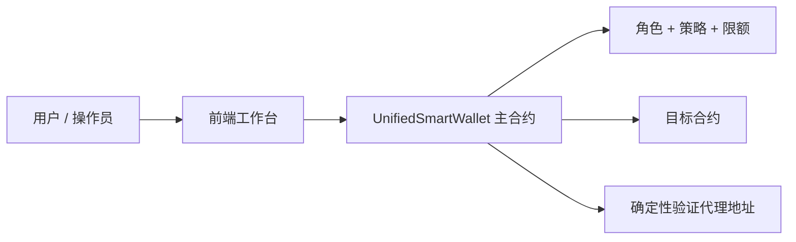
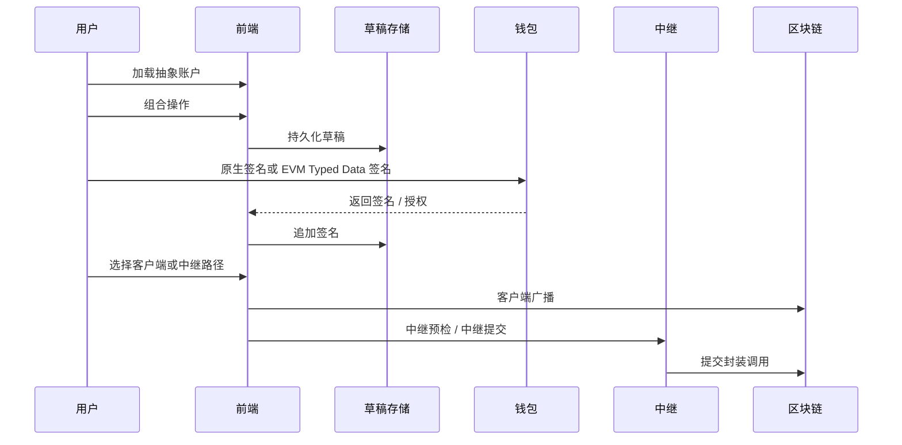
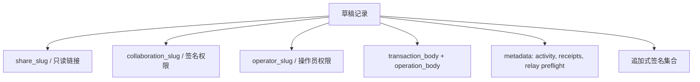

# 工作原理与使用指南

本指南会从整体上解释 Neo 抽象账户系统：合约在做什么、网站如何组织、用户如何创建和使用账户、协作草稿如何工作，以及交易最终如何到链上。

## 1. 核心理解

本项目中的抽象账户**不是**为每个用户单独部署一个新合约。

系统采用的是：一个全局主合约 + 针对每个逻辑账户派生出的确定性验证代理地址。

因此系统具备以下特点：

- 所有账户共用同一套链上执行引擎
- 无需为每个账户单独部署合约，降低成本
- 通过 `accountId` 隔离每个账户的配置与状态
- 同时支持原生 Neo 签名与 EVM EIP-712 签名

## 2. 链上架构分层

智能合约大体分成以下几层：

1. **账户生命周期** —— 创建账户、绑定确定性地址
2. **存储与上下文** —— 规范化存储键，管理执行锁与临时验证上下文
3. **执行与权限** —— 鉴权并执行白名单 / 黑名单 / 限额检查
4. **元交易** —— 恢复 EVM 签名者，并接入同一权限引擎
5. **管理与策略** —— 角色、阈值、验证器、Dome、限额等配置
6. **Oracle / Dome** —— 非活跃恢复路径
7. **升级** —— 仅部署者可执行的升级入口

## 3. 用户工作流

大多数用户都通过首页工作台完成操作：

## 4. 草稿协作模型

网站现在采用三层草稿权限模型：

- **分享链接** —— 只读查看
- **协作者链接** —— 仅用于收集签名
- **操作员链接** —— 中继预检、广播、回执写入、链接轮换

这意味着查看者不能修改草稿，签名者不能冒充操作员，而操作员在链接泄露时可以轮换写权限链接。

## 5. 交易路径

### 客户端路径

浏览器钱包直接签名并广播经过 AA 包装后的调用。

### 中继路径

前端会准备“已签名原始交易”或“中继就绪的元调用”。中继服务可以先模拟执行，再在配置完成后真正提交交易。

## 6. 执行前的策略检查

所有执行路径都会经过同一套保护逻辑：

- 账户是否存在
- 角色 / 阈值鉴权
- 可选的自定义验证器
- Dome 超时 + Oracle 解锁
- 方法白名单
- 黑名单 / 白名单
- 最大转账限额

## 7. 前端与 Supabase 的数据流

Supabase 保存的是协作草稿状态，而不是链上核心授权规则。

操作员级别的动作通过服务端签名变更路径执行，因此即使操作员链接泄露，也不足以单独完成广播或链接轮换。

## 8. 用户如何使用网站

### 新用户

1. 打开 **首页**
2. 加载或派生抽象账户
3. 选择预设操作或自定义调用
4. 持久化草稿
5. 根据协作角色分享不同链接
6. 收集签名
7. 如有需要运行中继预检
8. 通过钱包或中继完成广播

### 签名者

1. 打开协作者链接
2. 查看草稿与操作快照
3. 添加手动签名或 EVM typed-data 授权
4. 将中继与广播交给操作员处理

### 操作员

1. 打开操作员链接
2. 监控签名进度与中继就绪状态
3. 运行预检
4. 通过客户端或中继完成广播
5. 在必要时轮换协作者或操作员链接

## 9. 推荐阅读顺序

如果你是第一次接触这个系统，建议按以下顺序阅读：

1. **工作原理与使用指南**
2. **核心架构**
3. **工作流生命周期**
4. **数据流与存储**
5. **SDK 集成**

## 10. 关键安全边界

- 确定性代理见证被限制在加固后的 AA 包装调用中
- 分享链接只读
- 协作者链接仅能收集签名
- 操作员动作通过服务端签名变更执行
- 直接代理签名的外部支出仍然无效
