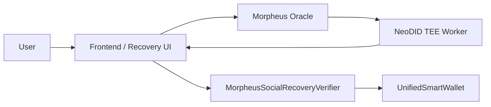

# Morpheus Social Recovery

This document explains how `neo-abstract-account` should use the Morpheus privacy oracle and NeoDID services for account recovery.

## Why Morpheus Fits AA Recovery

The AA wallet already supports a pluggable `custom verifier` contract per account.
That is the correct integration point for Morpheus.

Instead of modifying the AA core execution model, Morpheus provides:

- private Web2 / exchange identity verification in a TEE
- signed recovery approvals tied to a specific AA recovery round
- replay protection through `action_nullifier`
- privacy-preserving factor registration through `master_nullifier`
- a metadata-only W3C DID layer for service discovery and verifier publication

For the cleanest UX, treat Web3Auth as the DID root:

- Web3Auth aggregates Google / Apple / Email / SMS / other social logins
- NeoDID stores `provider = "web3auth"`
- NeoDID verifies the live Web3Auth `id_token` inside the TEE and derives the stable provider root there
- caller-supplied `provider_uid` is only an optional consistency hint, not the trusted root of identity
- AA verifiers consume only NeoDID tickets, not raw Web3Auth or social-provider details
- the public service DID is `did:morpheus:neo_n3:service:neodid`
- the public resolver route is `/api/neodid/resolve?did=did:morpheus:neo_n3:service:neodid`

## Recommended Architecture

### Roles

- `UnifiedSmartWallet`
  - remains the single on-chain policy engine
  - uses `setVerifierContract` to delegate authorization
- `MorpheusSocialRecoveryVerifier`
  - stores recovery ownership, factor configuration, and private action session state
  - verifies Morpheus recovery tickets
  - exposes `verify(accountId)` and `verifyMetaTx(accountId, signerHashes)`
- `Morpheus Oracle + NeoDID`
  - produce privacy-preserving, TEE-signed recovery approvals

## What Was Added In This Repo

### 1. AA admin path now honors custom verifiers

Previously, a custom verifier could authorize `execute` paths but not admin mutations such as:

- `setAdmins`
- `setManagers`
- `setWhitelistMode`
- `setVerifierContract`

That meant a recovered verifier owner could still be blocked from rotating the native admin set.

This is now fixed in `contracts/AbstractAccount.Admin.cs`.

### 2. MorpheusSocialRecoveryVerifier contract

The new recovery verifier is included at:

- `contracts/recovery/MorpheusSocialRecoveryVerifier.Fixed.cs`

It is designed to consume:

- Morpheus `neodid_recovery_ticket` outputs for account recovery
- Morpheus `neodid_action_ticket` outputs for short-lived private execution sessions

## Recovery Ticket Model

The verifier expects Morpheus to sign a digest over:

- `network`
- `aaContract`
- `verifierContract`
- `accountAddress`
- `accountIdText`
- `newOwner`
- `recoveryNonce`
- `expiresAt`
- `actionId`
- `masterNullifier`
- `actionNullifier`

The domain separator is:

- `neodid-recovery-v1`

## Recovery Lifecycle

### Setup

The current owner calls:

- `SetupRecovery(accountId, accountIdText, network, owner, aaContract, accountAddress, masterNullifiers, threshold, timelock, morpheusVerifier)`

This stores:

- current verifier owner
- Morpheus verifier key
- allowed factor `master_nullifier` values
- threshold
- timelock
- AA contract binding
- deterministic AA address binding
- human-readable `accountIdText` used in the Morpheus ticket digest

### Approval

For each approved social factor, the user submits:

- `SubmitRecoveryTicket(...)`

The verifier checks:

- Morpheus signature validity
- ticket expiry
- current recovery nonce
- recovery factor allowlist membership
- unused `action_nullifier`
- no duplicate approval for the same factor in the same recovery round

### Finalization

After threshold and timelock:

- `FinalizeRecovery(accountId)`

This updates the verifier-side owner.

After that, the recovered owner can immediately use the verifier path to call AA admin methods and rotate:

- native admins
- managers
- whitelist / blacklist policy
- verifier contract itself

## Why This Is Better Than Native Dome-Only Recovery

The built-in dome oracle path is still useful for inactivity unlocks.
But Morpheus-based recovery is better for social recovery because it adds:

- multiple identity providers
- encrypted provider inputs
- TEE attestation evidence
- factor privacy
- one-time recovery approvals
- explicit recovery-round binding

## Current Limitation

The verifier now includes an on-chain callback path and can call Morpheus Oracle directly via `RequestRecoveryTicket(...)`.

That means the recommended flow is now:

1. configure the verifier with the Morpheus Oracle hash and Morpheus verifier key
2. seal the current Web3Auth `id_token` with the Morpheus Oracle public key
3. call `RequestRecoveryTicket(...)`
4. let Morpheus route `neodid_recovery_ticket` through the Oracle callback path
5. optionally resolve `did:morpheus:neo_n3:aa:<account-id>` or the service DID for public metadata
6. wait for the Morpheus callback into `OnOracleResult(...)`
7. let the verifier activate recovery state on-chain without exposing provider details to the AA core contract

## Future Extension Ideas

- combine Morpheus recovery factors with human guardians and dome inactivity recovery
- use Morpheus pricefeeds or private compute for risk-based recovery policies
- add richer DID / notification workflow UX around Web3Auth-linked identities
