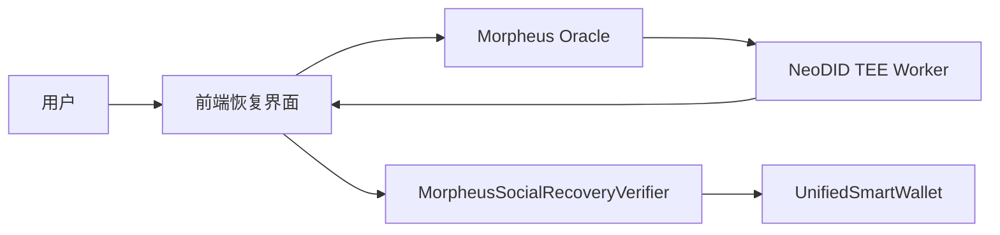

# Morpheus 社交恢复

本文说明 `neo-abstract-account` 应如何使用 Morpheus 隐私预言机与 NeoDID 服务来完成账户恢复。

## 为什么 Morpheus 适合 AA 恢复

AA 钱包本身已经支持按账户绑定可插拔的 `custom verifier` 合约。
这正是 Morpheus 的正确集成点。

Morpheus 不需要修改 AA 核心执行模型，而是提供：

- 在 TEE 中完成私密 Web2 / 交易所身份验证
- 绑定到特定恢复轮次的签名恢复授权
- 通过 `action_nullifier` 实现重放保护
- 通过 `master_nullifier` 实现隐私恢复因子注册
- 通过元数据型 W3C DID 层公开服务发现与 verifier 发布信息

为了获得最顺滑的用户体验，推荐把 Web3Auth 作为 DID 根：

- Web3Auth 聚合 Google / Apple / Email / SMS / 其他社交登录
- NeoDID 使用 `provider = "web3auth"`
- NeoDID 在 TEE 内校验实时 `id_token`，并在其中导出稳定的 provider root
- 调用方提交的 `provider_uid` 仅作为可选一致性提示，不是信任根
- AA 验证器只消费 NeoDID ticket，不直接消费 Web3Auth 或底层社交细节
- 当前公共服务 DID 为 `did:morpheus:neo_n3:service:neodid`
- 当前公共 resolver 路径为 `/api/neodid/resolve?did=did:morpheus:neo_n3:service:neodid`

## 推荐架构

### 角色划分

- `UnifiedSmartWallet`
  - 仍然是唯一的链上策略执行引擎
  - 通过 `setVerifierContract` 委托授权判断
- `MorpheusSocialRecoveryVerifier`
  - 保存恢复所有权、恢复因子配置与私密会话状态
  - 校验 Morpheus 恢复票据
  - 暴露 `verify(accountId)` 与 `verifyMetaTx(accountId, signerHashes)`
- `Morpheus Oracle + NeoDID`
  - 产出隐私保护、TEE 签名的恢复授权结果

## 本仓库新增内容

### 1. AA 管理员路径现在支持 custom verifier

此前 custom verifier 只能授权 `execute` 路径，不能授权以下管理动作：

- `setAdmins`
- `setManagers`
- `setWhitelistMode`
- `setVerifierContract`

这会导致即便恢复成功，新的 verifier owner 仍然无法旋转原生管理员集合。

该问题已在 `contracts/AbstractAccount.Admin.cs` 中修复。

### 2. MorpheusSocialRecoveryVerifier 合约

新的恢复验证器位于：

- `contracts/recovery/MorpheusSocialRecoveryVerifier.Fixed.cs`

它设计用来消费：

- 用于账户恢复的 Morpheus `neodid_recovery_ticket`
- 用于短期私密执行会话的 Morpheus `neodid_action_ticket`

## 恢复票据模型

验证器要求 Morpheus 对以下字段的摘要进行签名：

- `network`
- `aaContract`
- `verifierContract`
- `accountAddress`
- `accountIdText`
- `newOwner`
- `recoveryNonce`
- `expiresAt`
- `actionId`
- `masterNullifier`
- `actionNullifier`

域分隔符为：

- `neodid-recovery-v1`

## 恢复生命周期

### 初始化

当前 owner 调用：

- `SetupRecovery(accountId, accountIdText, network, owner, aaContract, accountAddress, masterNullifiers, threshold, timelock, morpheusVerifier)`

这会存储：

- 当前 verifier owner
- Morpheus verifier key
- 允许的恢复因子 `master_nullifier`
- threshold
- timelock
- AA 合约绑定
- 确定性的 AA 地址绑定
- 在 Morpheus ticket 摘要中使用的人类可读 `accountIdText`

### 授权

对于每一个已批准的社交因子，用户提交：

- `SubmitRecoveryTicket(...)`

验证器会检查：

- Morpheus 签名是否合法
- ticket 是否过期
- 当前 recovery nonce
- 恢复因子是否在 allowlist 中
- `action_nullifier` 是否未使用
- 同一恢复轮次下是否重复批准同一因子

### 最终完成

满足 threshold 与 timelock 后，调用：

- `FinalizeRecovery(accountId)`

这会更新 verifier 侧的 owner。

此后，恢复后的 owner 可以立刻通过 verifier 路径调用 AA 管理操作，旋转：

- 原生 admins
- managers
- whitelist / blacklist policy
- verifier 合约本身

## 为什么优于原生 Dome-only 恢复

内置 dome oracle 路径对“长期不活跃解锁”仍然有用。
但对社交恢复来说，Morpheus 更强，因为它增加了：

- 多身份提供方支持
- 加密 provider 输入
- TEE attestation 证据
- 恢复因子隐私
- 一次性恢复授权
- 显式恢复轮次绑定

## 当前推荐流程

验证器现在包含链上 callback 路径，并可直接通过 `RequestRecoveryTicket(...)` 调用 Morpheus Oracle。

推荐流程如下：

1. 为 verifier 配置 Morpheus Oracle 合约哈希和 Morpheus verifier key
2. 使用 Morpheus Oracle 公钥加密当前 Web3Auth `id_token`
3. 调用 `RequestRecoveryTicket(...)`
4. 让 Morpheus 通过 Oracle callback 路径路由 `neodid_recovery_ticket`
5. 如有需要，可解析 `did:morpheus:neo_n3:aa:<account-id>` 或服务 DID 获取公开元数据
6. 等待 Morpheus 回调 `OnOracleResult(...)`
7. 让 verifier 在链上激活恢复状态，同时不把 provider 细节暴露给 AA 核心合约

## 后续扩展方向

- 将 Morpheus 恢复因子与人类 guardians、dome inactivity recovery 组合
- 使用 Morpheus pricefeed 或隐私计算实现风险驱动恢复策略
- 为 Web3Auth 关联身份增加更丰富的 DID / 通知工作流体验
