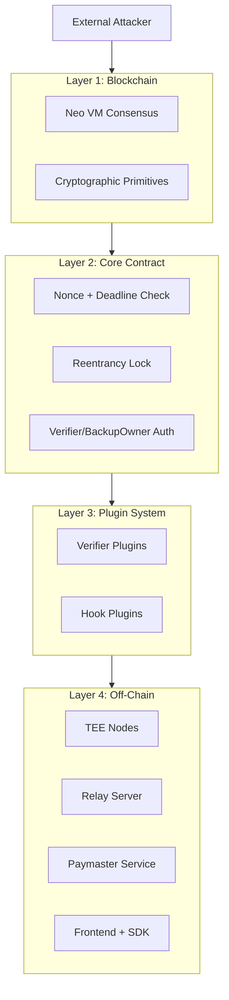
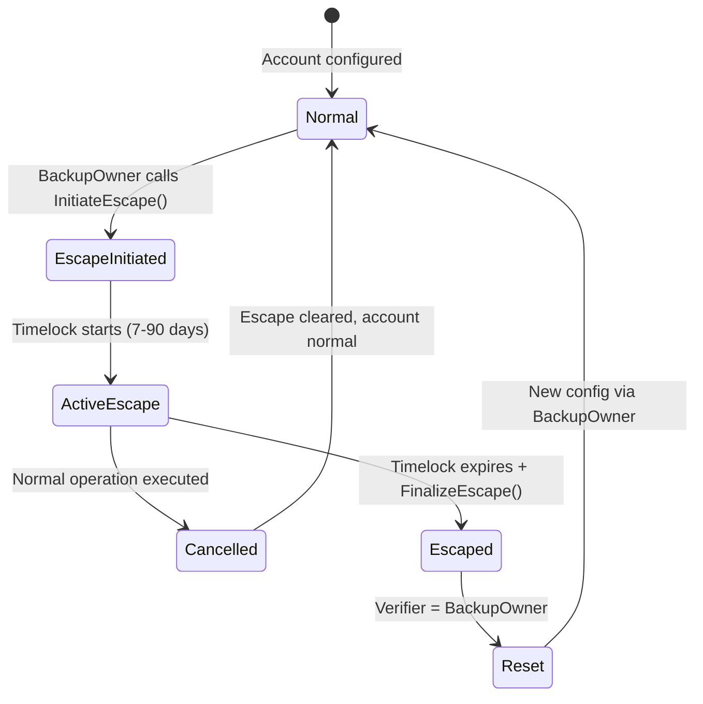

# Neo N3 Abstract Account Security Model

## Executive Summary

The Neo N3 Abstract Account system implements a policy-gated, plugin-based account abstraction architecture. This document defines the threat model, trust assumptions, security properties, and defense-in-depth mechanisms across all layers of the system.

---

## 1. Threat Model

### 1.1 Attackers

| Attacker Type | Capabilities | Primary Attack Vectors |
| --- | --- | --- |
| **External Attacker** | No private keys, can submit transactions | Replay, gas DoS, front-running, signature forgery |
| **Compromised Verifier** | Control of verifier signing key | Unauthorize withdrawals, bypass hooks |
| **Compromised Relay** | Can submit to bundler/relay | Censorship, front-running, selective relay |
| **Compromised TEE Node** | TEE private key access | Unlimited automated transactions |
| **Compromised Paymaster Sponsor** | Sponsor wallet private key | Policy manipulation, deposit withdrawal |
| **Stolen Cold Wallet** | Backup owner private key | Escape hatch takeover |
| **Smart Contract Developer** | Plugin code deployment | Logic bugs, backdoors, malicious hooks/verifiers |

### 1.2 Assets at Risk

| Asset | Protection Mechanism | Threat Level |
| --- | --- | --- |
| **Native Neo Tokens** (NEO, GAS) | Verifier signature + Hook policies + Nonce | High |
| **NEP-17 Tokens** | Verifier signature + Hook policies + Nonce | High |
| **NFTs / SBTs** | Verifier signature + Hook policies + Nonce | Medium |
| **Account Control** (Verifier, Hooks, BackupOwner) | Timelocks, authority checks | Critical |
| **Reputation / Identity** | NeoDID binding + Credential hooks | Medium |

---

## 2. Trust Assumptions

### 2.1 Layer 1: Neo N3 Blockchain

| Assumption | Rationale | Risk if Violated |
| --- | --- | --- |
| **NeoVM is sound** | Code execution is deterministic | Global consensus failure |
| **Cryptography is secure** | secp256k1/r1 are battle-tested | Private key recovery via weaknesses |
| **Network is Byzantine** | < 1/3 honest nodes | Chain reorganizations |

### 2.2 Layer 2: Core Contract

| Assumption | Rationale | Risk if Violated |
| --- | --- | --- |
| **Verifier plugins are honest** | Signature = authorization | Malicious verifier drains funds |
| **Hook plugins don't censor** | Policies only reject, not modify | Hook prevents valid operations |
| **Backup owner is secure** | L1 escape mechanism | Account takeover without recovery |

### 2.3 Layer 3: Plugin Ecosystem

| Assumption | Rationale | Risk if Violated |
| --- | --- | --- |
| **Plugin deployment is authorized** | Only backup owner can install | Unauthorized plugin installation |
| **TEE enclaves are secure** | Hardware-level isolation | TEE key compromise |
| **Relays are semi-honest** | Multiple competing relays | Censorship or front-running |
| **Paymaster is solvent** | On-chain deposit balance or off-chain gas sponsorship | Failed transactions if deposit exhausted |
| **Paymaster policy is honest** | Sponsor controls policy creation | Sponsor can revoke/expire policies at will |

### 2.4 Layer 4: Frontend & SDK

| Assumption | Rationale | Risk if Violated |
| --- | --- | --- |
| **User's device is secure** | Private key storage | Key theft via malware |
| **RPC endpoints are honest** | Transaction submission | Transaction censorship |
| **Supabase is secure** | Draft/collaboration storage | Draft manipulation |

---

## 3. Security Properties by Layer

### 3.1 Core Contract Layer

| Property | Implementation | Threat Mitigated |
| --- | --- | --- |
| **Integrity** | State in `UnifiedSmartWallet` | Contract can't be modified without deployer |
| **Confidentiality** | Public ledger | No private data on-chain |
| **Availability** | No per-account deployment | Single point of failure |
| **Non-repudiation** | Nonce + Deadline | Sender can't deny transaction |
| **Replay Protection** | Nonce + Network ID + Deadline | Can't replay on same/different chain |

### 3.2 Verification Layer

| Property | Implementation | Threat Mitigated |
| --- | --- | --- |
| **Authentication** | Verifier signature checks | Unauthorized ops rejected |
| **Authorization** | Backup owner / Verifier separation | Privilege escalation prevented |
| **Freshness** | Nonce increment / Salt consumption | Replay rejected |
| **Cross-chain isolation** | `Runtime.GetNetwork()` in payload | Can't replay across networks |

### 3.3 Policy/Hook Layer

| Property | Implementation | Threat Mitigated |
| --- | --- | --- |
| **Transfer limits** | `DailyLimitHook` | Large thefts mitigated |
| **Target allowlisting** | `WhitelistHook` | Fraudulent contract interaction blocked |
| **Token restrictions** | `TokenRestrictedHook` | Unauthorized token transfers blocked |
| **Credential gating** | `NeoDIDCredentialHook` | Unverified users blocked |
| **Composability** | `MultiHook` | Combined policies enforce AND logic |

### 3.4 Recovery Layer

| Property | Implementation | Threat Mitigated |
| --- | --- | --- |
| **L1 fallback** | Backup owner native witness | Verifier failure recovery |
| **Delayed takeover** | Escape timelock (7-90 days) | Immediate takeover prevented |
| **Activity cancellation** | Normal ops cancel escape | Stolen wallet can't quietly takeover |
| **Auditability** | Escape events logged | Recovery attempts visible |

---

## 4. Defense-in-Depth Architecture

### Layer 1: Blockchain Primitives
- **NeoVM:** Deterministic execution, bounded gas
- **Cryptography:** secp256k1 (EVM), secp256r1 (Passkey/TEE), SHA256, Keccak256

### Layer 2: Core Contract
- **Nonce + Deadline:** Replay protection
- **Execution Lock:** Reentrancy prevention (`IsAnyExecutionActive()`)
- **Verify Context:** Limits `CheckWitness(accountId)` to execution context
- **Authority Separation:** Verifier (who) vs Hook (what) vs Core (how)

### Layer 3: Plugin System
- **Verifier Isolation:** Stateless, no direct state access
- **Hook Gating:** Pre/post execution policies
- **Authority Validation:** `CanConfigureVerifier` / `CanExecuteHook` checks
- **Module Lifecycle:** Timelocked updates with events

### Layer 4: Off-Chain Infrastructure
- **TEE Attestation:** Hardware root of trust (future)
- **Relay Diversity:** Multiple competing relays prevent censorship
- **Paymaster Policy:** Off-chain sponsorship rules
- **Frontend Sanitization:** Input validation, error message stripping

---

## 5. Critical Security Invariants

### 5.1 Must-Hold Invariants

1. **Nonce Monotonicity:** Nonces never decrease within a channel
2. **Deterministic Address:** Same `accountId` always resolves to same address
3. **Replay Prevention:** Same operation cannot execute twice
4. **Context Isolation:** `CheckWitness(accountId)` only valid during `executeUserOp`
5. **Escape Atomicity:** Either completes fully or not at all
6. **Market Escrow Exclusivity:** Escape/initiative changes blocked during escrow

### 5.2 Should-Hold Invariants

1. **Gas Limits on Verifiers:** *(VIOLATED)* Verifiers can consume unbounded gas
2. **Plugin State Cleanup:** *(PARTIAL)* Market settlement may leave orphaned storage
3. **Session Key Revocation:** *(PARTIAL)* Race condition between clear and use

---

## 6. Attack Surface Analysis

### 6.1 Known Vulnerabilities

| ID | Severity | Component | Description | Status |
| --- | --- | --- | --- |
| **VULN-001** | Critical | **Verifier Gas DoS** | Verifiers have no gas limit | Open |
| **VULN-002** | High | **Escape Hatch Bypass** | Market escrow clears escape state | Open |
| **VULN-003** | High | **Session Key Race** | Clear/use timing window | Open |
| **VULN-004** | Medium | **MultiSig Empty Array** | No explicit empty check | Open |
| **VULN-005** | Medium | **Plugin State Orphaning** | Settlement cleanup incomplete | Open |
| **VULN-006** | Low | **Nonce Collision** | Salt space insufficiently large | Open |

### 6.2 Mitigated Attack Vectors

| Attack | Mitigation | Status |
| --- | --- | --- |
| **Signature Replay** | Nonce + Network ID + Deadline | ✓ Mitigated |
| **Reentrancy** | Execution lock + Context isolation | ✓ Mitigated |
| **Cross-Chain Replay** | `Runtime.GetNetwork()` in all payloads | ✓ Mitigated |
| **Front-Running** | Nonce prevents same-op reuse | ✓ Mitigated |
| **Hook Censorship** | Hooks only reject, don't modify | ✓ Mitigated |
| **Verifier Bypass** | Authority checks on all calls | ✓ Mitigated |
| **Market Escrow Censorship** | Direct cancel available | ✓ Mitigated |
| **Paymaster Front-Running** | On-chain atomic settlement; off-chain decision pre-submission | ✓ Mitigated (on-chain) / Partially mitigated (off-chain) |
| **Paymaster Deposit Drain** | Per-op limits + daily budgets + total budgets | ✓ Mitigated |
| **RPC Censorship** | Multiple relays + client-side broadcast | ✓ Mitigated |

---

## 7. Cryptographic Security

### 7.1 Signature Schemes

| Scheme | Curve | Key Size | Security Level | Use Cases |
| --- | --- | --- | --- |
| **Neo Native** | secp256r1 | 256-bit | Backup owner |
| **EVM/EIP-712** | secp256k1 | 256-bit | Web3Auth |
| **WebAuthn/Passkey** | secp256r1 | 256-bit | Biometrics |
| **TEE** | secp256r1 | 256-bit | Automated agents |
| **Session Key** | secp256r1 | 256-bit | Temporary delegation |

### 7.2 Hash Functions

- **SHA256:** Used for payload hashing in most verifiers
- **Keccak256:** Used for `Web3AuthVerifier` EIP-712 compatibility
- **Nonce Hashing:** Storage key includes `accountId` + channel/salt

### 7.3 Replay Protection Mechanisms

1. **Nonce:**
   - Sequential: Auto-increment per channel
   - Salt: UUID-based, tracked in storage

2. **Deadline:**
   - Absolute timestamp (`Runtime.Time`)
   - Must be in future for execution

3. **Network ID:**
   - `Runtime.GetNetwork()` included in payload hash
   - Prevents cross-chain replay

---

## 8. Operational Security

### 8.1 Relay Server Security

| Mechanism | Purpose |
| --- | --- |
| **Rate Limiting** | Prevent DoS via request flooding (10 req/min) |
| **Request Durability** | Prevent double-submission via deduplication |
| **Input Validation** | Script hash allowlist, raw transaction bounds |
| **Error Sanitization** | Strip sensitive information from error responses |
| **Simulation First** | Validate before broadcasting to save gas |

### 8.2 Paymaster Security

#### On-Chain Paymaster (`AAPaymaster`)

| Mechanism | Purpose |
| --- | --- |
| **Deposit-Backed** | Sponsorship is only possible with pre-deposited GAS |
| **Policy Enforcement** | Per-account or global policies with target/method restrictions |
| **Per-Op Limits** | Each operation capped to `MaxPerOp` GAS |
| **Daily Budget** | Rolling 24-hour spend cap per (sponsor, account) pair |
| **Total Budget** | Lifetime spend cap with overflow protection |
| **Expiry Timestamps** | Policies auto-expire at `ValidUntil` |
| **Core-Only Settlement** | Only the authorized AA core contract can call `settleReimbursement` |
| **Checks-Effects-Interactions** | Deposit deducted before GAS transferred to relay |
| **Atomic Execution** | Settlement reverts if policy check or GAS transfer fails |

#### Off-Chain Paymaster (Morpheus)

| Mechanism | Purpose |
| --- | --- |
| **API Token Auth** | Prevent unauthorized sponsorship |
| **Off-chain Validation** | Apply business rules before chain submission |
| **Network Isolation** | Testnet/Mainnet separation |
| **Reason Disclosure** | Explain rejections to users |

### 8.3 TEE Security

| Mechanism | Purpose |
| --- | --- |
| **Hardware Attestation** | *(Future)* Verify genuine TEE execution |
| **Policy Enforced in TEE** | Complex logic off-chain, signature on-chain |
| **Session Key Issuance** | TEE-bound temporary delegation |

---

## 9. Recovery & Emergency Access

### 9.1 Escape Hatch Flow

### 9.2 Security Properties

| Property | Guarantee |
| --- | --- |
| **Delayed Takeover** | 7-90 day minimum timelock |
| **Cancel-on-Use** | Any valid op cancels escape |
| **Audit Trail** | All escape events emitted |
| **No Bypass** | *(PARTIAL)* Market escrow can clear escape |

---

## 10. Compliance & Privacy

### 10.1 Privacy Properties

| Data | On-Chain | Public |
| --- | --- | --- |
| **Verifier Public Key** | ✓ | ✓ Signature verification required |
| **Hook Policies** | ✓ | ✓ Allowlist/rules visible |
| **Transaction History** | ✓ | ✓ Ledger transparency |
| **User Identity** | ✗ | Off-chain only (DID) |
| **Session Keys** | ✓ (public) | ✓ Temporary delegation visible |

### 10.2 Regulatory Considerations

| Requirement | Support |
| --- | --- |
| **KYC/AML Integration** | Via `NeoDIDCredentialHook` |
| **Sanctions Screening** | Via `WhitelistHook` |
| **Transaction Monitoring** | Via relay server logs |
| **Recovery Standard** | L1 timelock escape hatch |
| **User Sovereignty** | Backup owner control guaranteed |

---

## 11. Future Security Enhancements

### 11.1 Critical Priority

1. **Verifier Gas Limits:** Add gas cap to verifier `validateSignature` calls
2. **Escape Escrow Protection:** Block market entry during active escape
3. **Session Key Delay:** Add revocation timelock window

### 11.2 Medium Priority

4. **TEE Attestation:** Integrate remote attestation verification
5. ~~**Paymaster Staking:**~~ Resolved — `AAPaymaster` contract provides on-chain deposit-backed sponsorship
6. **Plugin Audit System:** Verified plugin marketplace

### 11.3 Low Priority

7. **Nonce Space Expansion:** Increase salt threshold to 2^64
8. **Account-Based Rate Limiting:** Per-account limits in relay
9. **Formal Verification:** Third-party security audit

---

## 12. References

- **ERC-4337:** https://eips.ethereum.org/EIPS/eip-4337
- **ERC-7579:** https://eips.ethereum.org/EIPS/eip-7579
- **Neo Documentation:** https://docs.neo.org/
- **Security Audit:** `docs/SECURITY_AUDIT.md`
- **Plugin Matrix:** `docs/PLUGIN_MATRIX.md`
