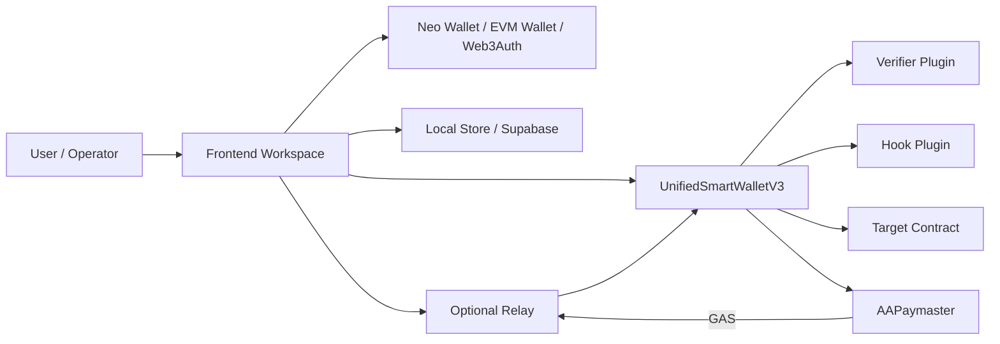
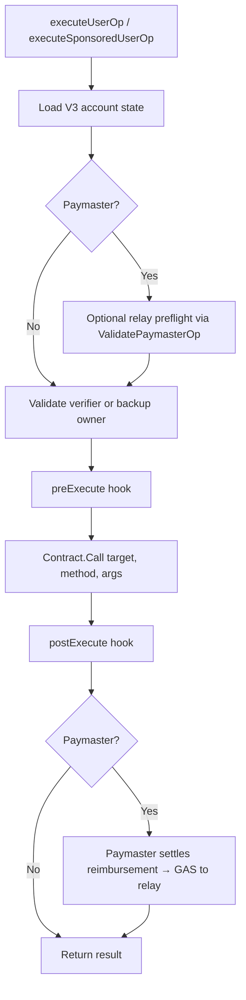

# Neo N3 Abstract Account Architecture

The active `main` branch is a **policy-gated** V3 architecture centered on `UnifiedSmartWalletV3`.

## 1. Component Map



## 2. Account Model

V3 is `accountId`-first.

- Each account is keyed by a deterministic 20-byte `accountId`.
- The public Neo address is derived locally from `verify(accountId)` plus the master contract hash.
- On-chain state stores:
  - `verifier`
  - `hook`
  - `backupOwner`
  - `escapeTimelock`
  - `escapeTriggeredAt`
  - nonce channels

The core wallet no longer depends on admin/manager/dome state as the main authorization surface.

## 3. Verification Pipeline

```mermaid
flowchart TD
  Start[Tx reaches Neo node] --> Verify[Node triggers verify(accountId)]
  Verify --> Context[Core checks active verification context]
  Context --> Allowed{Expected target?}
  Allowed -- No --> Reject1[Reject unexpected witness use]
  Allowed -- Yes --> Execute[executeUserOp(accountId, op)]
  Execute --> Auth{Verifier plugin passes or backup owner witness passes?}
  Auth -- No --> Reject2[Reject unauthorized operation]
  Auth -- Yes --> Nonce[Consume nonce + deadline]
  Nonce --> Hooks[Run hooks around execution]
  Hooks --> Return[Return result]
```

## 4. Application Execution Pipeline



The V3 core is intentionally small: authorization is delegated to verifier plugins, policy is delegated to hook plugins, and the core enforces nonce consumption, recovery state, and execution context.

## 5. Authorization Modes

- Backup-owner native witness
- Web3Auth / EIP-712 verifier
- TEE / WebAuthn / SessionKey / MultiSig / ZKEmail verifier plugins
- Custom hook-mediated policy checks

## 6. Contract File Map

| File | Responsibility |
| --- | --- |
| `contracts/UnifiedSmartWallet.cs` | Core V3 account state, `verify`, `executeUserOp`, nonce handling, backup-owner escape, hook/verifier config |
| `contracts/verifiers/Web3AuthVerifier.cs` | EIP-712 `UserOperation` verification |
| `contracts/verifiers/TEEVerifier.cs` | TEE-signed authorization |
| `contracts/verifiers/WebAuthnVerifier.cs` | Passkey / WebAuthn authorization |
| `contracts/verifiers/SessionKeyVerifier.cs` | Short-lived delegated keys |
| `contracts/verifiers/MultiSigVerifier.cs` | Plugin multisig |
| `contracts/verifiers/ZKEmailVerifier.cs` | Email-based authorization extension |
| `contracts/hooks/*.cs` | Optional policies such as daily limits, token restrictions, and credential gating |
| `contracts/paymaster/Paymaster.cs` | On-chain Paymaster for sponsored/gasless transactions (GAS deposits, policies, settlement) |
| `contracts/paymaster/PaymasterAuthority.cs` | Paymaster admin + authorized core validation |

## 7. Module Lifecycle

V3 now has two layers of lifecycle signaling:

- legacy compatibility events that remain verifier-specific or hook-specific,
- and a generic module lifecycle that treats verifiers and hooks as first-class modules.

The generic lifecycle is:

- **install**: first binding of a verifier or hook emits `ModuleInstalled`
- **replace**: timelocked replacement emits `ModuleUpdateInitiated` and later `ModuleUpdateConfirmed`
- **remove**: replacement to `UInt160.Zero`, market settlement cleanup, or escape-driven clearing emits `ModuleRemoved`
- **cancel**: aborting a pending verifier or hook rotation emits `ModuleUpdateCancelled`

This keeps older indexers working while giving new tooling one consistent lifecycle model to consume.

## 8. Recovery Model

V3 recovery is explicit:

1. `initiateEscape(accountId)` starts the backup-owner timelock.
2. `finalizeEscape(accountId, newVerifier)` rotates the verifier after the delay.
3. Any successful normal execution clears an in-progress escape flow.

This keeps recovery auditable without reintroducing large role graphs into the core wallet.

## 9. Paymaster (Sponsored Transactions)

The `AAPaymaster` contract enables trustless gasless execution on Neo N3:

1. **Deposit:** Sponsors send GAS to the Paymaster via NEP-17 transfer.
2. **Policy:** Sponsors call `setPolicy(accountId, targetContract, method, maxPerOp, dailyBudget, totalBudget, validUntil)`. Use `accountId = Zero` for a global policy sponsoring any account.
3. **Execution:** Relay calls `executeSponsoredUserOp(accountId, op, paymaster, sponsor, reimbursementAmount)` on the AA core.
4. **Settlement:** Core validates policy, executes the UserOp, then calls `paymaster.settleReimbursement()` to atomically deduct from the sponsor deposit and transfer GAS to the relay.

The Paymaster never authorizes execution — it only funds the relay after the verifier and hooks have already approved the operation.

## 10. Security Invariants

1. `verify(accountId)` is only valid inside the expected `executeUserOp` context.
2. Nonces are consumed by the core wallet, not verifier plugins.
3. Verifier plugins do not bypass hook or target-contract policy.
4. Backup-owner recovery is timelocked.
5. New integrations should target `executeUserOp`; legacy `executeUnifiedByAddress` is compatibility-only.
6. Paymaster settlement only succeeds when called by the authorized AA core contract.
7. Paymaster deposit deduction happens before the GAS transfer to the relay (checks-effects-interactions).
