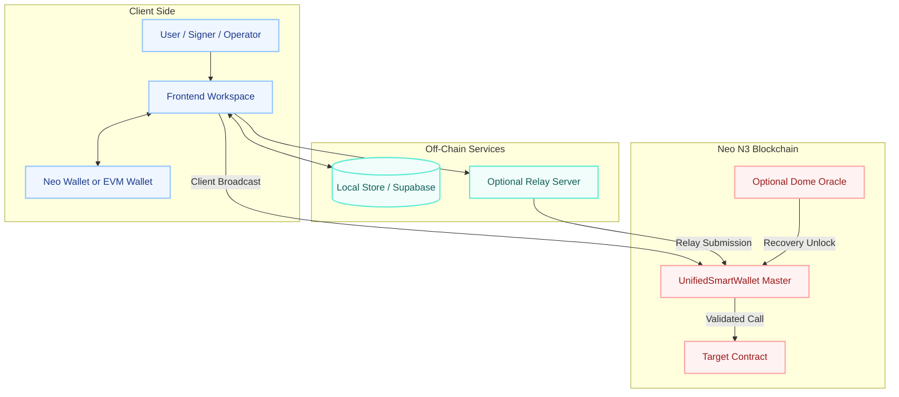
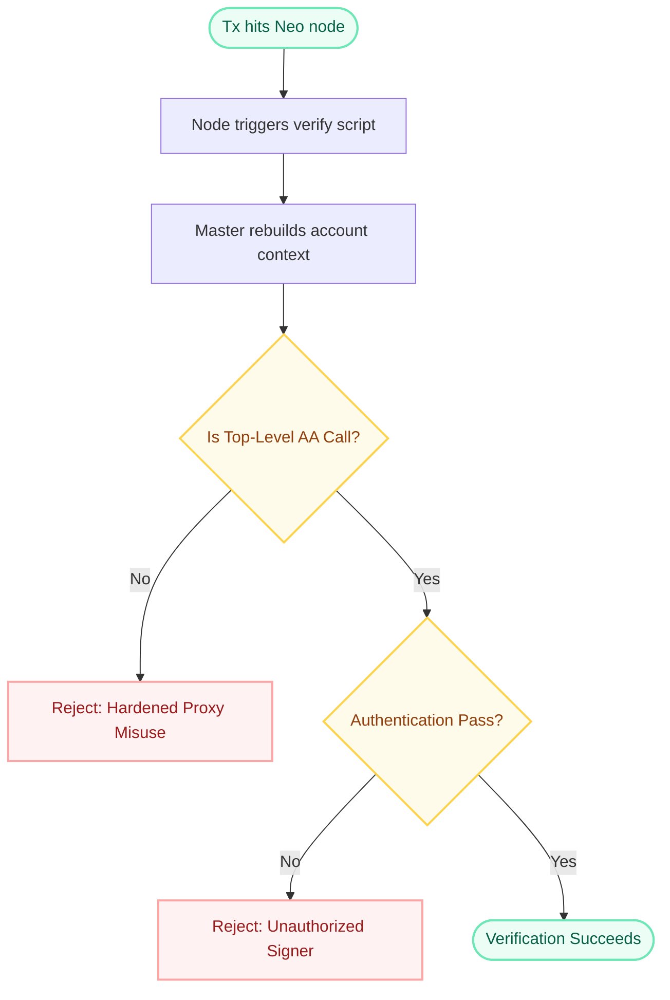
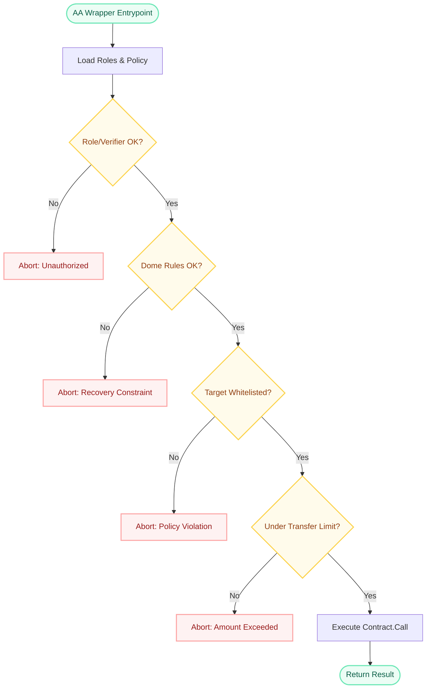

# Neo N3 Abstract Account Architecture

The Neo N3 Abstract Account system is a **policy-gated** smart contract wallet architecture. It decouples a user's logical account identity from any single signing key while still preserving a deterministic Neo address and a strict execution boundary.

## 1. Component Map

The system has one shared execution engine and several supporting boundaries around it.



### Why this shape exists

- **No per-user contract deployment:** users do not pay to deploy unique wallet logic
- **Deterministic addressing:** each logical account still has a stable verify address
- **Centralized enforcement:** every supported path runs through the same permission engine
- **Optional off-chain helpers:** draft sharing and relay APIs improve UX without redefining on-chain authority

## 2. Deterministic Addressing

When a user creates an account, no new contract is deployed. Instead, the system derives a deterministic verify script from the master contract hash plus `accountId`, and the resulting script hash becomes the public Neo address for that account.

That address is the user's stable entry point, but verification always routes back into the master contract.

## 3. Verification Pipeline

The verification phase decides whether the transaction is allowed to act as the abstract account.



The hardened rule is important: direct proxy-signed external token transfers are rejected. Supported entrypoints are the AA wrapper methods such as `execute`, `executeByAddress`, `executeMetaTx`, and `executeMetaTxByAddress`.

## 4. Application Execution Pipeline

After verification succeeds, the AA contract still has to enforce the execution policy before calling any external target.



This is why the design is safer than a raw proxy witness alone: the application phase is where the contract can enforce policy-gated execution.

## 5. Contract File Map

The implementation is split into focused contract files:

| File | Responsibility |
| --- | --- |
| `contracts/AbstractAccount.cs` | Top-level entrypoints, shared types, and integration glue |
| `contracts/AbstractAccount.AccountLifecycle.cs` | Account creation, address binding, and lifecycle state |
| `contracts/AbstractAccount.StorageAndContext.cs` | Storage-key normalization, execution lock handling, and transient call context |
| `contracts/AbstractAccount.ExecutionAndPermissions.cs` | Core execution path plus whitelist / blacklist / transfer-limit checks |
| `contracts/AbstractAccount.MetaTx.cs` | EIP-712 meta-transaction verification and signer recovery |
| `contracts/AbstractAccount.Admin.cs` | Admin / manager role mutation, thresholds, and governance operations |
| `contracts/AbstractAccount.Oracle.cs` | Dome oracle request, callback, and unlock logic |
| `contracts/AbstractAccount.Upgrade.cs` | Deployer-only update path |

## 6. Account Discovery and Reverse Indices

The system maintains reverse indices for efficient role-based account discovery:

### Storage Layout

```
AdminIndexPrefix (0x20):
  address → serialized List<ByteString> of account IDs

ManagerIndexPrefix (0x21):
  address → serialized List<ByteString> of account IDs
```

### Index Maintenance

Reverse indices are automatically maintained during role mutations:

- **SetAdminsInternal:** Removes old admin entries, adds new admin entries
- **SetManagersInternal:** Removes old manager entries, adds new manager entries
- **CreateAccountInternal:** Adds creator as default admin to index

### Query Operations

```csharp
// O(1) lookup by address
public static List<ByteString> GetAccountsByAdmin(UInt160 address)
public static List<ByteString> GetAccountsByManager(UInt160 address)
```

### Batch Creation

```csharp
public static void CreateAccountBatch(
    List<ByteString> accountIds,
    List<UInt160>? admins,
    int adminThreshold,
    List<UInt160>? managers,
    int managerThreshold)
```

**Key behaviors:**
- Transaction sender automatically becomes default admin
- All accounts share the same governance configuration
- Single transaction reduces gas costs
- Atomic operation ensures consistency

## 7. Authorization Modes

The contract supports several ways to authorize an action, but they all converge into the same protected execution path:

- **Native Neo signers** using admin / manager threshold logic
- **Custom verifier contracts** for pluggable authorization logic
- **EVM EIP-712 signatures** for `executeMetaTx` and `executeMetaTxByAddress`
- **Dome recovery actors** once inactivity and optional oracle conditions are satisfied

Custom verifiers extend authorization, but they do **not** bypass whitelist, blacklist, method policy, or max-transfer enforcement.

## 7. Recovery and Extensibility

The architecture also includes optional recovery and extension surfaces:

- **Dome recovery** for inactivity-based social recovery
- **Oracle gating** for extra real-world unlock conditions
- **Custom verifiers** for bespoke authorization logic
- **Relay-ready meta flows** for EVM-first user experiences

## 8. Security Invariants

The most important invariants to remember are:

1. The deterministic proxy does not replace the master contract; it routes into it.
2. The verification phase and the application phase are separate, and both matter.
3. Direct proxy-signed external spends are intentionally blocked.
4. Shared drafts are collaboration tools, not permission bypasses.
5. Every production path remains bound to the same on-chain policy engine.
