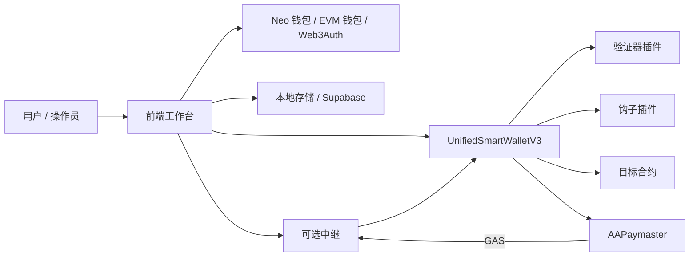
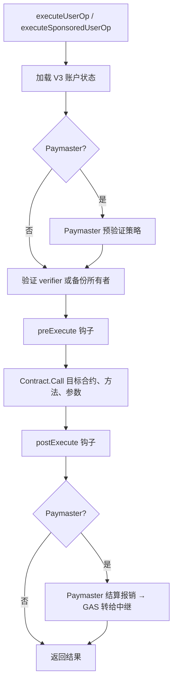

# 核心架构

Neo N3 抽象账户协议利用 Neo VM 的验证脚本机制，将一个逻辑账户绑定到确定性的验证代理地址，而不是为每个用户部署独立钱包合约。

## 架构要点

- **主合约**：统一保存账户角色、策略、阈值与限制
- **确定性代理地址**：由 `accountId` 与主合约共同确定
- **统一执行入口**：原生执行与 EVM 元交易都进入同一权限管线
- **共享逻辑、隔离状态**：所有账户共用一套逻辑，但按 `accountId` 隔离配置

## 组件图

## 应用执行管线

V3 核心刻意保持小巧：授权委托给验证器插件，策略委托给钩子插件，核心仅负责 nonce 消费、恢复状态和执行上下文。

## 合约文件索引

| 文件 | 职责 |
| --- | --- |
| `contracts/UnifiedSmartWallet.cs` | V3 核心账户状态、`verify`、`executeUserOp`、nonce 处理、备份所有者逃生、钩子/验证器配置 |
| `contracts/verifiers/Web3AuthVerifier.cs` | EIP-712 `UserOperation` 验证 |
| `contracts/verifiers/TEEVerifier.cs` | TEE 签名授权 |
| `contracts/verifiers/WebAuthnVerifier.cs` | Passkey / WebAuthn 授权 |
| `contracts/verifiers/SessionKeyVerifier.cs` | 短期委托密钥 |
| `contracts/verifiers/MultiSigVerifier.cs` | 插件多签 |
| `contracts/verifiers/ZKEmailVerifier.cs` | 基于邮件的授权扩展 |
| `contracts/hooks/*.cs` | 可选策略：每日限额、代币限制、凭证门控等 |
| `contracts/paymaster/Paymaster.cs` | 链上 Paymaster，用于赞助/无 GAS 交易（GAS 存款、策略、结算） |
| `contracts/paymaster/PaymasterAuthority.cs` | Paymaster 管理员 + 授权核心合约校验 |

## Paymaster（赞助交易）

`AAPaymaster` 合约在 Neo N3 上实现无需信任的无 GAS 执行：

1. **存入：** 赞助商通过 NEP-17 转账将 GAS 发送到 Paymaster 合约。
2. **策略：** 赞助商调用 `setPolicy(accountId, targetContract, method, maxPerOp, dailyBudget, totalBudget, validUntil)`。使用 `accountId = Zero` 可创建全局策略，赞助任意账户。
3. **执行：** 中继调用 AA 核心的 `executeSponsoredUserOp(accountId, op, paymaster, sponsor, reimbursementAmount)`。
4. **结算：** 核心验证策略，执行 UserOp，然后调用 `paymaster.settleReimbursement()` 原子性地从赞助商存款中扣除并将 GAS 转给中继。

Paymaster 不会授权执行 —— 它只在验证器和钩子已经批准操作后，才为中继提供资金。

## 安全不变量

1. `verify(accountId)` 仅在预期的 `executeUserOp` 上下文中有效。
2. Nonce 由核心钱包消费，而非验证器插件。
3. 验证器插件不会绕过钩子或目标合约策略。
4. 备份所有者恢复受时间锁保护。
5. 新集成应使用 `executeUserOp`；旧版 `executeUnifiedByAddress` 仅用于兼容。
6. Paymaster 结算仅在由授权的 AA 核心合约调用时成功。
7. Paymaster 存款扣除先于 GAS 转账给中继执行（检查-效果-交互模式）。

## 价值

1. **零部署成本**：用户不需要为新账户额外支付合约部署成本
2. **统一升级与审计**：逻辑集中在主合约，更易加固与维护
3. **多生态签名**：同时支持 Neo 与 EVM 钱包接入
