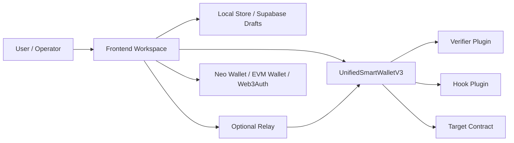
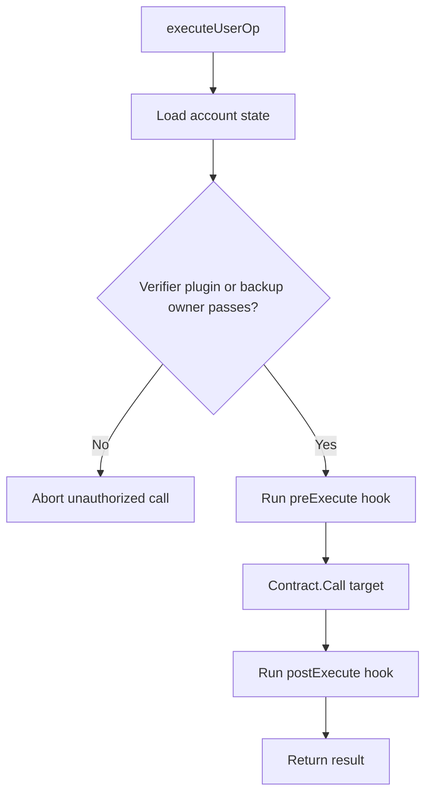

# Core Architecture

This page describes the active `main`-branch architecture for `UnifiedSmartWalletV3`.

## 1. Component Map



The Neo N3 Abstract Account system is a **policy-gated** smart contract wallet architecture. V3 keeps one shared execution engine and moves account-specific auth and policy into plugin bindings instead of embedding large role tables inside the core wallet.

## 2. Account Model

Each account is keyed by a deterministic 20-byte `accountId`.

- The frontend derives `accountId` from a seed, pubkey, or already-hashed 20-byte value.
- The virtual Neo address is derived locally from `verify(accountId)` plus the master contract hash.
- On-chain account state stores:
  - `verifier`
  - `hook`
  - `backupOwner`
  - `escapeTimelock`
  - `escapeTriggeredAt`
  - nonce channels

V3 is therefore **accountId-first**. Reverse discovery from legacy role indexes is no longer part of the active model.

## 3. Verification Pipeline

```mermaid
flowchart TD
  Start[Tx reaches Neo node] --> Verify[Node triggers verify(accountId)]
  Verify --> Context[Core checks transient execution context]
  Context --> Allowed{Target matches active ExecuteUserOp call?}
  Allowed -- No --> Reject1[Reject unexpected witness use]
  Allowed -- Yes --> Execute[ExecuteUserOp(accountId, op)]
  Execute --> Auth{Verifier plugin passes or backup owner witness passes?}
  Auth -- No --> Reject2[Reject unauthorized operation]
  Auth -- Yes --> Nonce[Consume nonce / deadline]
  Nonce --> PreHook[Run preExecute hook if configured]
  PreHook --> Call[Contract.Call(target, method, args)]
  Call --> PostHook[Run postExecute hook if configured]
  PostHook --> Return[Return result]
```

## 4. Application Execution Pipeline



## 5. Authorization Modes

V3 supports several authorization modes, but they all converge on `executeUserOp(accountId, op)`:

- **Backup-owner native witness** when no verifier plugin is configured.
- **Web3Auth / EIP-712 verifier** for secp256k1 typed-data approvals.
- **TEE / WebAuthn / SessionKey / MultiSig / ZKEmail** verifier plugins.
- **Custom hooks** for policy enforcement or post-execution bookkeeping.

This is the critical boundary: verifier plugins decide **who may authorize**, while hook plugins decide **what extra policy runs around execution**.

## 6. Escape Hatch

Every V3 account can define a backup owner and timelock.

1. `initiateEscape(accountId)` starts the backup-owner recovery window.
2. After the timelock elapses, `finalizeEscape(accountId, newVerifier)` rotates the verifier binding.
3. Any successful normal `executeUserOp` clears an in-progress escape flow.

That makes recovery explicit and auditable without reintroducing the old V2 admin/manager graph.

## 7. Frontend and Relay Model

The app workspace is V3-first:

- users load an account from its deterministic seed or `accountId` hash
- the UI stages `executeUserOp`
- EVM signatures are attached as relay-ready invocations
- operators can choose client broadcast or relay submission
- shared drafts keep only the latest 100 activity entries and 12 submission receipts

Legacy `executeUnifiedByAddress` handling remains compatibility-only and should not be presented as the primary runtime path.

## 8. Contract File Map

| File | Responsibility |
| --- | --- |
| `contracts/UnifiedSmartWallet.cs` | V3 core account state, nonce handling, `verify`, `executeUserOp`, hook/verifier config, backup-owner escape |
| `contracts/verifiers/Web3AuthVerifier.cs` | EIP-712 `UserOperation` verification for secp256k1/Web3Auth flows |
| `contracts/verifiers/TEEVerifier.cs` | TEE-signed authorization |
| `contracts/verifiers/WebAuthnVerifier.cs` | Passkey / WebAuthn authorization |
| `contracts/verifiers/SessionKeyVerifier.cs` | Short-lived delegated execution keys |
| `contracts/verifiers/MultiSigVerifier.cs` | Plugin-based multisig authorization |
| `contracts/hooks/*.cs` | Optional execution policies such as daily limits, token restrictions, credential gating, and hook composition |

## 9. Security Invariants

1. `verify(accountId)` only succeeds during a matching `executeUserOp` context.
2. Nonces are consumed in the core wallet, not in the verifier plugins.
3. Verifier plugins do not automatically grant policy bypass; hooks and target contracts still run.
4. Backup-owner recovery is timelocked and explicit.
5. The user-facing V3 path is deterministic `accountId -> virtual address -> executeUserOp`.
