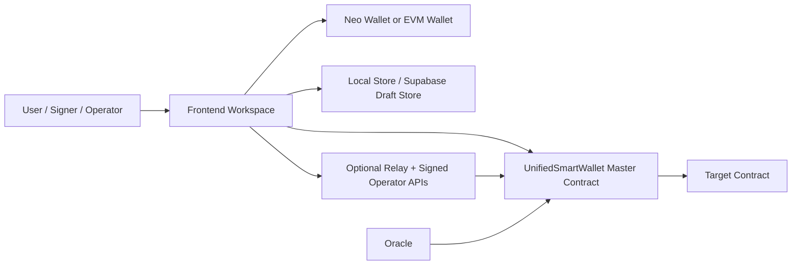
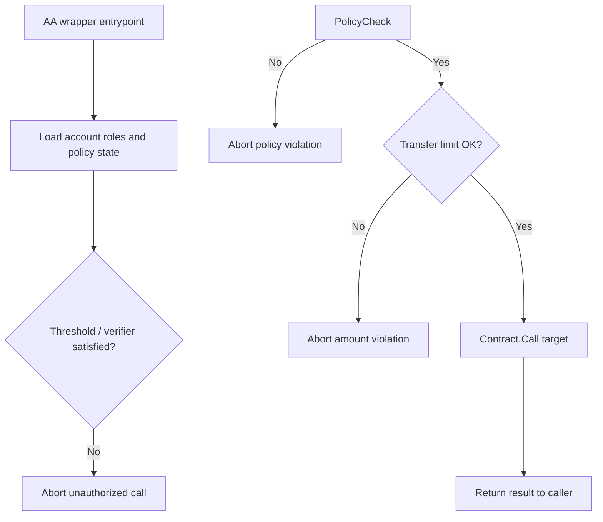

# Core Architecture

This page mirrors the repository architecture explainer so the frontend docs bundle has a clear component-level view of the system.

## 1. Component Map



The Neo N3 Abstract Account system is a **policy-gated** smart contract wallet design with one shared execution engine and deterministic per-account verify addresses.

## 2. Verification Pipeline

```mermaid
flowchart TD
  Start[Tx hits Neo node] --> Verify[Node triggers verify(accountId)]
  Verify --> Context[Master contract rebuilds account context]
  Context --> SelfCall{Top-level script is an AA self-call?}
  SelfCall -- No --> Reject1[Reject hardened proxy misuse]
  SelfCall -- Yes --> Auth{Auth path passes?}
  Auth -- No --> Reject2[Reject unauthorized signer / verifier result]
  Auth -- Yes --> Pass[Verification succeeds]
```

The hardened rule blocks direct proxy-signed external token transfers. The canonical runtime entrypoints are `executeUnified` and `executeUnifiedByAddress`.

## 3. Application Execution Pipeline



## 4. Contract File Map

| File | Responsibility |
| --- | --- |
| `contracts/AbstractAccount.cs` | Top-level entrypoints and shared glue |
| `contracts/AbstractAccount.AccountLifecycle.cs` | Account creation and address binding |
| `contracts/AbstractAccount.StorageAndContext.cs` | Storage normalization and execution locks |
| `contracts/AbstractAccount.ExecutionAndPermissions.cs` | Policy checks and target execution |
| `contracts/AbstractAccount.MetaTx.cs` | EIP-712 verification and signer recovery |
| `contracts/AbstractAccount.Admin.cs` | Role and threshold governance |
| `contracts/AbstractAccount.Upgrade.cs` | Deployer-only update path |

## Matrix Naming Layer

The `.matrix` naming layer remains outside the AA master contract trust boundary. Registration can be batched in the same transaction as AA creation, but the domain itself is treated as a human-readable discovery layer rather than a direct authority primitive.
