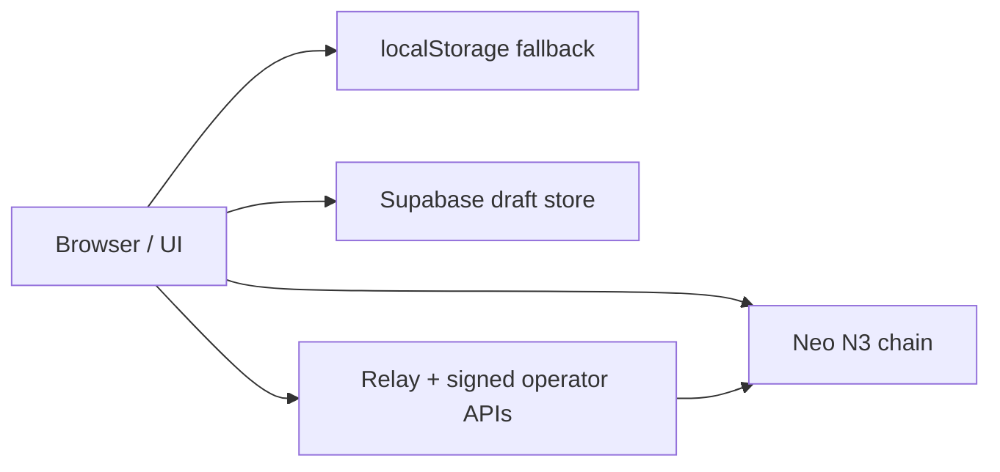
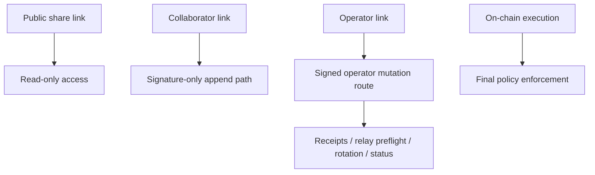
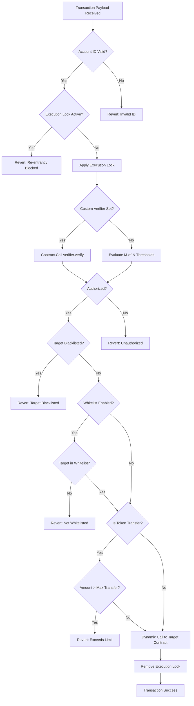
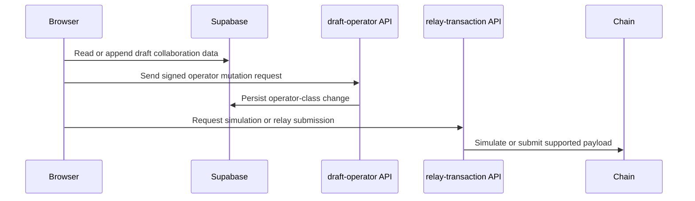

# Contract Data Flow & Storage

The Abstract Account model centralizes all on-chain authority inside the **Master Entry Contract**, while using the browser, Supabase, and optional relay services to improve usability and collaboration.

## 1. System Boundaries

The easiest way to understand the system is to separate it into trust boundaries.



Those boundaries do different jobs:

- **Browser** prepares invocations, displays readiness, and holds temporary UI state
- **localStorage** preserves local-only drafts when Supabase is absent
- **Supabase** stores collaborative draft data and scoped links
- **Relay APIs** simulate or submit relay-ready payloads and accept signed operator mutations
- **Neo N3 chain** stores the real account rules and executes the final call

## 2. Data Ownership Matrix

| Boundary | What lives there | Who can mutate it | Why it exists |
| --- | --- | --- | --- |
| On-chain master contract | Admins, managers, thresholds, whitelist / blacklist, verifier, dome, limits, nonces | Authorized AA governance flows | Source of truth for authorization and execution |
| Browser memory | Current workspace state, selected payload mode, active wallet session | Current browser session | Fast UX and staging |
| `localStorage` fallback | Local-only drafts and preferences | Same browser only | Offline / no-Supabase development path |
| Supabase | Draft body, append-only signatures, bounded activity, bounded receipts, scoped slugs | Scope-limited collaboration flows | Shared review and multi-party coordination |
| Relay server | Simulation results in flight, relay signer use, signed operator mutation validation | Server config + signed operator requests | UX helper for relay and operator-only actions |

## 3. Mutation Authority by Boundary

Not every boundary is allowed to mutate the same data.



Practical meaning:

- public viewers can inspect a draft but cannot mutate it
- collaborators can add signatures but cannot append operator-class relay activity
- operators can request higher-sensitivity mutations, but the server still validates signed intent
- the chain remains the final authority for whether the transaction is valid

## 4. Storage Schema On-Chain

The contract utilizes a unified internal storage mapping where keys are derived by concatenating a static prefix with a hashed representation of the user's `accountId`.

```mermaid
flowchart TD
    A[Master Contract Storage] --> B(Admins Map)
    A --> C(Managers Map)
    A --> D(Dome Configuration)
    A --> E(Limits & Restrictions)

    B --> B1[Prefix: 0x01 + sha256(accountId)]
    C --> C1[Prefix: 0x03 + sha256(accountId)]
    D --> D1[Prefix: 0x0E + sha256(accountId)]
    E --> E1[Prefix: 0x09 / 0x0B / 0x0C composite keys]
```

## 5. Internal Data Flow During Execution

When an execution command enters the Master Contract, it flows through a rigid pipeline of isolation, verification, and restriction checks before any external smart contract is called.



## 6. Relay and Signed Operator Mutation Flow

The relay and operator helper paths exist to improve usability, not to replace the contract.



## 7. Retention and Practical Limits

The collaborative metadata layer is intentionally bounded:

- latest **100 activity entries** retained
- latest **12 submission receipts** retained
- immutable draft body preserved separately from append-only signature history

This keeps long-lived drafts explainable and reviewable without letting metadata grow without limit.

## 8. Storage Key Prefixes Table

| Prefix Identifier | Hex Value | Purpose |
| :--- | :---: | :--- |
| `AdminsPrefix` | `0x01` | Serialized array of admin addresses. |
| `AdminThresholdPrefix` | `0x02` | Integer threshold for admins. |
| `ManagersPrefix` | `0x03` | Serialized array of manager addresses. |
| `ManagerThresholdPrefix` | `0x04` | Integer threshold for managers. |
| `BlacklistPrefix` | `0x09` | Composite key for blocked external contracts. |
| `WhitelistPrefix` | `0x0B` | Composite key for allowed external contracts. |
| `MaxTransferPrefix` | `0x0C` | Composite key for token transfer caps. |
| `VerifierContractPrefix` | `0x12` | Script hash of custom verifier logic. |

## Matrix Domain Resolution Boundary

The `.matrix` contract is an external naming boundary. It does not replace AA authorization state. Instead, the frontend resolves a `.matrix` domain to a controller wallet address and then queries AA admin/manager address indexes to find the corresponding bound AA addresses.
