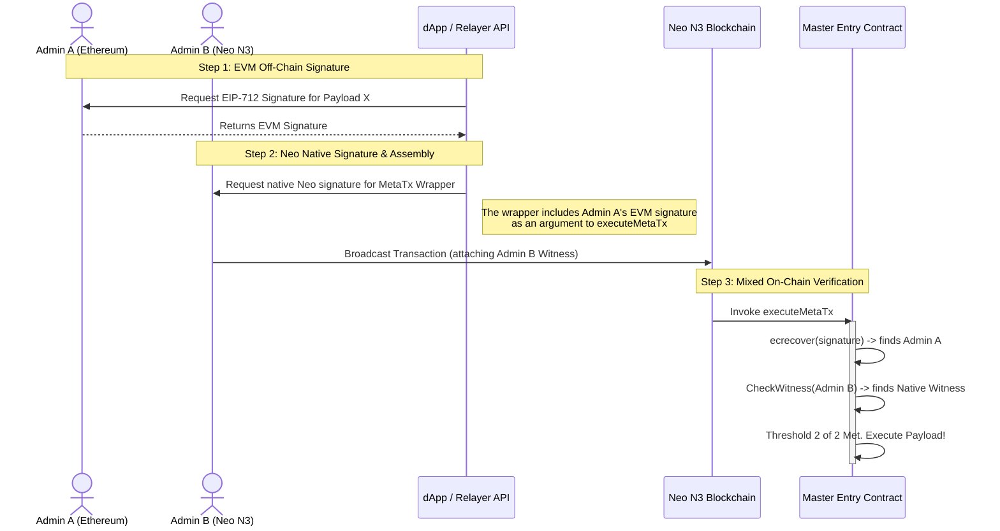

# Mixed Multi-Sig (N3 + EVM)

One of the most powerful features of the Neo N3 Abstract Account is its ability to seamlessly aggregate signatures across entirely different blockchain ecosystems. 

You can construct a single Abstract Account where the `Admin` or `Manager` roles are composed of a mix of native Neo N3 addresses (e.g., NeoLine wallets) and Ethereum addresses (e.g., MetaMask wallets). 

## How It Works

When a Meta-Transaction is relayed to the network, the Master Entry Contract utilizes a `CheckMixedSignatures` pipeline. It does not force all required signatures to come from the same source:

1. **EVM Extraction:** It first parses the EIP-712 payload and performs `ecrecover` on the provided array of EVM signatures to derive the Ethereum addresses.
2. **Native Witness Fallback:** For every role address required to meet the threshold, it checks if that address matches one of the extracted EVM addresses. If it doesn't, it drops down into the Neo VM and checks if a native Neo cryptographic witness (`Runtime.CheckWitness()`) was attached to the outer transaction wrapper.
3. **Aggregation:** It counts the total valid signatures across both ecosystems. If the combined total meets the required `Threshold`, the execution proceeds.

## Constructing a Mixed Multi-Sig Transaction

Imagine an Abstract Account configured with an **Admin Threshold of 2**, containing:
- **Admin A**: `0x71C...` (Ethereum Wallet)
- **Admin B**: `Nd5...` (Neo N3 Wallet)

Here is the step-by-step workflow of how both users sign the *exact same transaction intent*.



### The SDK / Code Implementation

The dApp coordinates this by collecting the EVM signature first, then passing it to the Neo N3 user to wrap into the final transaction.

**Step 1: Collect Ethereum Signature (Admin A)**
```javascript
// Admin A signs the EIP-712 payload using MetaMask
const { domain, types, message } = await aaClient.createEIP712Payload({ ...metaTx });
const evmSignature = await ethersSigner.signTypedData(domain, types, message);
```

**Step 2: Build & Broadcast the Neo Transaction (Admin B)**
```javascript
// Admin B takes Admin A's signature and puts it in the args array
const sb = new sc.ScriptBuilder();
sb.emitAppCall(masterContractHash, 'executeMetaTx', [
  sc.ContractParam.byteArray(accountId),
  sc.ContractParam.array([ sc.ContractParam.byteArray(adminA_uncompressedPubKey) ]),
  sc.ContractParam.hash160(targetContract),
  sc.ContractParam.string(method),
  sc.ContractParam.array(...args),
  sc.ContractParam.byteArray(argsHash),
  sc.ContractParam.integer(nonce),
  sc.ContractParam.integer(deadline),
  sc.ContractParam.array([ sc.ContractParam.byteArray(evmSignature) ]) // Inject EVM Sig
]);

const script = sb.build();

// Admin B signs the entire Neo transaction, attaching their native N3 witness
const tx = await neoWallet.invoke({
  scriptHash: masterContractHash,
  operation: 'executeMetaTx', // Just for the wallet prompt UI
  script: script,
  signers: [
    { account: adminB_ScriptHash, scopes: tx.WitnessScope.Global } // Inject N3 Sig
  ]
});
```

Because Admin B is signing the transaction containing Admin A's signature, the Master Contract sees **both** actors actively authorizing the payload during execution.