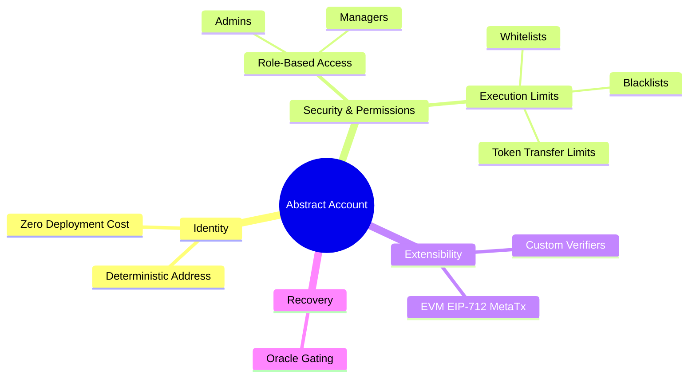

# Overview & Description

The Neo N3 Abstract Account protocol is a robust, enterprise-grade smart contract wallet standard designed to decouple account identities from their underlying cryptographic key pairs. Conceptually similar to Ethereum's ERC-4337, this architecture transforms standard accounts into policy-gated programmable wallets.

By transitioning from standard ECDSA signatures to deterministic proxy contracts, developers and users can implement advanced multi-signature structures, EVM cross-chain execution capabilities, social recovery mechanisms, and fine-grained operational limits without sacrificing user experience.

## Capabilities at a Glance

1. **Role-Based Access Control:** Separate thresholds for Admins and Managers.
2. **Dome Recovery:** Social recovery networking to restore lost keys.
3. **Execution Limits:** Policy-gated method access plus universal Blacklists, Whitelists, and Token Transfer Limits.
4. **EIP-712 Compatibility:** Support for standard EVM wallets like MetaMask natively.
5. **Custom Verifiers:** Build and deploy fully custom C# smart contracts to govern verification (e.g. ZK-proofs, time-locks).

## Navigation Guide

Use the sidebar to explore the technical depths of this protocol:
* **Core Architecture**: Understand how deterministic proxies work.
* **Workflow Lifecycle**: See the sequence of actions for deployment and Meta-Transactions.
* **Data Flow & Storage**: Inspect how state is organized securely.
* **Custom Verifiers**: Explore how to write C# contracts that govern account verification.
* **Ethereum / EVM Integration**: Instructions for cross-chain users.
* **Mixed Multi-Sig (N3 + EVM)**: How to aggregate native Neo and MetaMask signatures simultaneously.
* **SDK Usage**: A guide on how to integrate the JavaScript SDK into your dApps.
