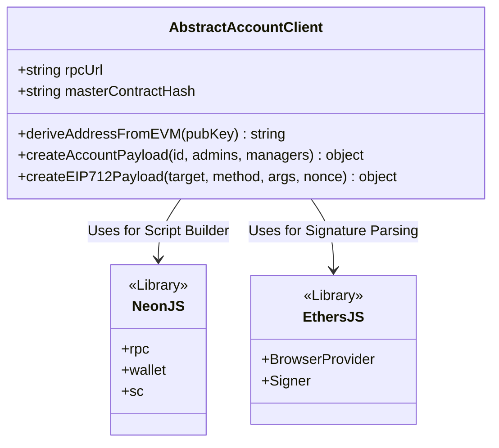

# Abstract Account SDK Integration

The Neo N3 Abstract Account SDK provides a clean JavaScript interface for developers to build dApps that interact with abstract accounts, handle EIP-712 cross-chain meta-transactions, and manage complex multisig configurations.

## Installation

Install the Neo Abstract Account SDK via npm:

```bash
npm install @cityofzion/neon-js ethers
# Or simply include the local sdk/js bundle from the repository
```

## SDK Architecture Overview



## 1. Initializing the Client

To interact with the network, you must initialize the `AbstractAccountClient` with your preferred Neo N3 RPC URL and the deployed Script Hash of the Master Entry Contract.

```javascript
const { AbstractAccountClient } = require('./sdk/src/index.js'); // Use npm package path in production

const rpcUrl = "https://testnet1.neo.coz.io:443";
const masterHash = "0xYourMasterContractHashHere";

const aaClient = new AbstractAccountClient(rpcUrl, masterHash);
```

## 2. Deriving Deterministic Addresses

You do not need to "deploy" an account to know its address. You can instantly derive the deterministic Neo N3 proxy address for any user if you know their `Account ID`. 

For Ethereum users, their uncompressed public key serves as the `Account ID`.

```javascript
// Example EVM Uncompressed Public Key (65 bytes)
const evmPubKey = "04d09c..."; 

// Derive the N3 address instantly
const proxyAddress = aaClient.deriveAddressFromEVM(evmPubKey);
console.log("Your abstract account address will be:", proxyAddress);
```

## 3. Account Creation Payload

When the user is ready to register their configuration on-chain, the SDK can generate the exact Neo VM `ScriptBuilder` payload required.

```javascript
const accountIdHex = evmPubKey; 
const admins = ["N..."]; // The user's Neo or Ethereum address
const adminThreshold = 1;
const managers = [];
const managerThreshold = 0;

const payload = aaClient.createAccountPayload(
  accountIdHex,
  admins,
  adminThreshold,
  managers,
  managerThreshold
);

// You can now submit this payload using NeonJS or NeonLine
console.log("Invocation Payload:", payload);
```

## 4. EIP-712 Payload Generation

If your dApp supports Ethereum users (via MetaMask), you will need to format Neo VM execution intents into a standard EIP-712 Typed Data object. The SDK handles the type bindings, domain separation, and Neo argument hashing automatically.

```javascript
const chainId = 888; // Example Neo-to-EVM Chain ID
const targetContract = "0xTargetNep17TokenHash";
const method = "transfer";
const args = [
    { type: 'Hash160', value: 'NFrom...' },
    { type: 'Hash160', value: 'NTo...' },
    { type: 'Integer', value: '100000000' },
    { type: 'Any', value: null }
];
const nonce = 1;

// 1. Generate the standard EIP-712 object
const { domain, types, message } = await aaClient.createEIP712Payload(
    chainId,
    targetContract,
    method,
    args,
    nonce
);

// 2. Request signature from MetaMask
// (Requires Ethers.js and window.ethereum)
const provider = new ethers.BrowserProvider(window.ethereum);
const signer = await provider.getSigner();

const signature = await signer.signTypedData(domain, types, message);

console.log("Ethereum Signature:", signature);
// This signature can now be sent to a Relayer to pay GAS and execute on Neo!
```