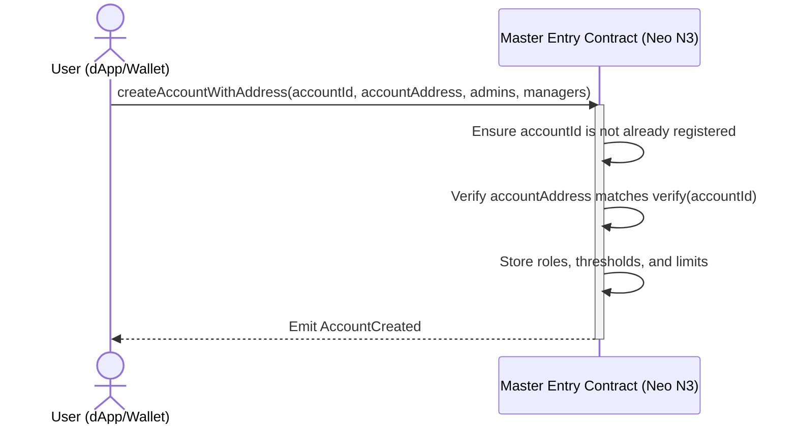
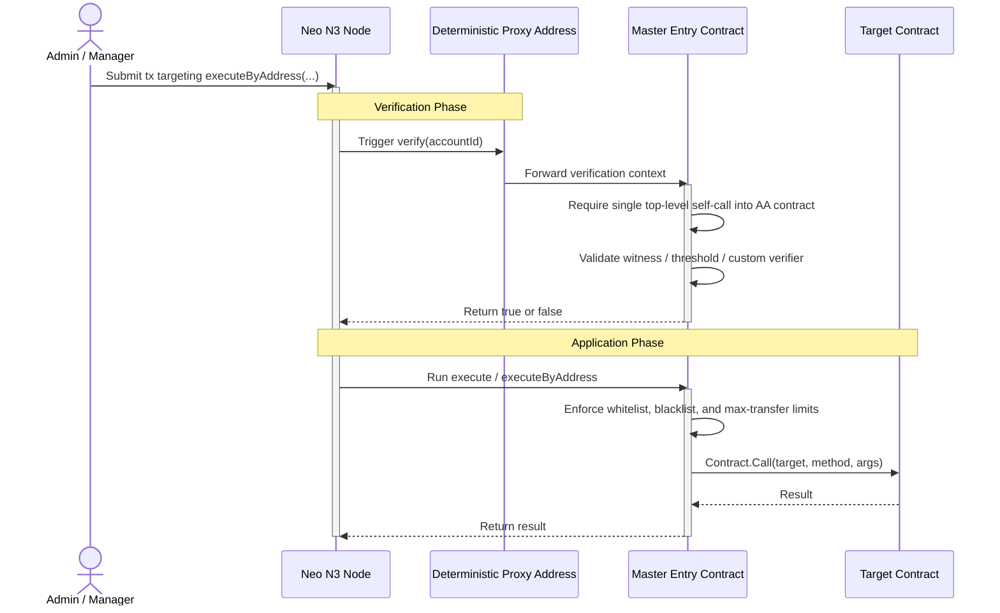
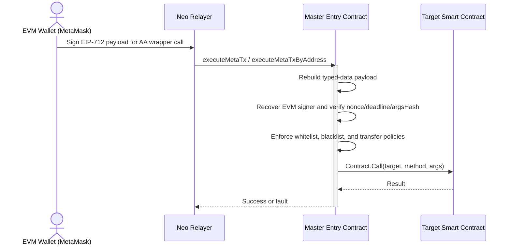

# Abstract Account Workflow Lifecycle

The Neo N3 Abstract Account workflow turns user intent into verified on-chain execution through the master contract. After the March 6, 2026 hardening update, deterministic proxy witnesses are only valid for a single top-level self-call back into the Abstract Account contract. That means direct proxy-signed external token transfers are rejected, while wrapper entrypoints such as `execute`, `executeByAddress`, `executeMetaTx`, and `executeMetaTxByAddress` remain the supported execution paths.

## 1. Account Initialization

No per-user contract deployment is required. The user submits configuration to the global master contract and binds a deterministic address.

## 2. Standard Native Invocation

Native Neo execution now flows through Abstract Account wrapper methods instead of relying on a raw proxy witness to call an external contract directly.

> Raw external contract calls signed only by the deterministic proxy are intentionally rejected after hardening.

## 3. Meta-Transaction Workflow

Ethereum users can still sign EIP-712 payloads off-chain while a Neo relayer pays network fees and submits the wrapped AA execution.

