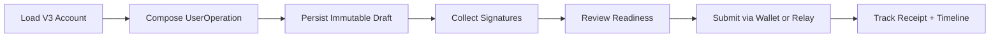
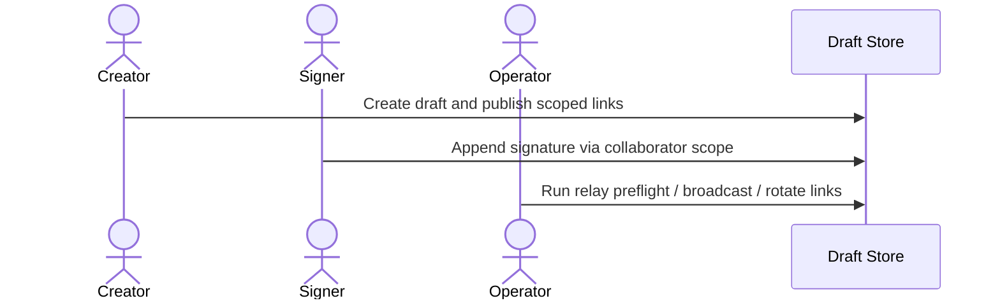
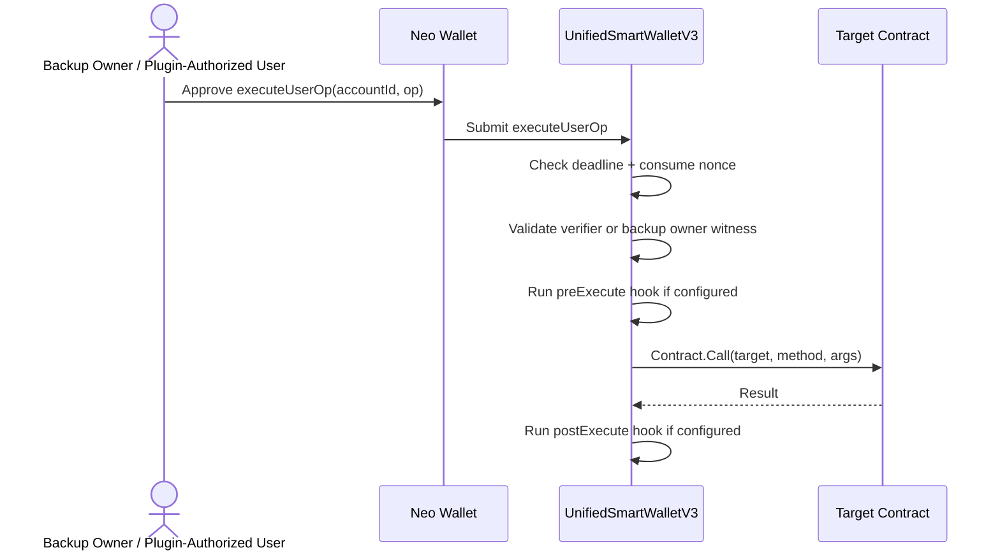
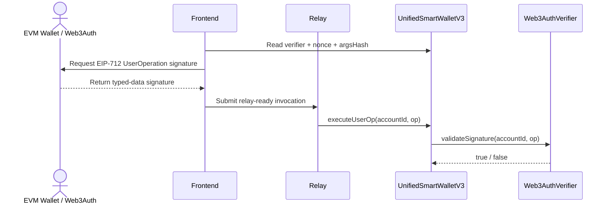

# Abstract Account Workflow Lifecycle

This page describes the active V3 workflow built around `UnifiedSmartWalletV3` and `executeUserOp(accountId, op)`.

Direct proxy-signed external calls are intentionally rejected after hardening. The supported V3 execution path is the core wallet's `executeUserOp`.

## App Workspace

The app workspace is the primary V3 operator surface.

- Load an account from a deterministic seed or 20-byte `accountId` hash.
- Derive the virtual Neo address locally.
- Stage a `UserOperation`.
- Persist an immutable draft.
- Collect Neo and EVM approvals.
- Choose client-side broadcast or relay broadcast.

The public share link is read-only, the collaborator link can append signatures, and the operator link can run relay checks, broadcasts, and link rotation. Shared drafts keep only the latest 100 activity entries and 12 submission receipts.

If Supabase is not configured, the same flow falls back to local-only `localStorage` persistence in the current browser.

## 1. First Transaction Walkthrough

1. **Load the account** from a deterministic seed or `accountId` hash.
2. **Choose the operation** with Generic Invoke, NEP-17 Transfer, or Multisig Draft.
3. **Stage the operation** as a V3 `executeUserOp` payload.
4. **Persist the draft** before collecting external approvals.
5. **Collect signatures** from Neo, EVM, or both.
6. **Review relay readiness** and choose the payload mode.
7. **Broadcast** with a Neo wallet or submit via relay.

## 2. Choose the Submission Path

| Path | Best for | Requirements | Tradeoff |
| --- | --- | --- | --- |
| Client-side broadcast | Native Neo wallet users | Browser wallet connected | Simplest and most transparent |
| Relay preflight | Operators who want simulation before submit | Relay endpoint configured | Adds server dependency, but gives VM/gas feedback |
| Relay raw submission | Existing signed raw transaction | Raw forwarding explicitly enabled | Compatibility-only passthrough |
| Relay invocation submission | EVM/UserOperation flows | Relay signer plus relay invocation mode | Most flexible form of relay broadcast for mixed-signature workflows |

When both raw and relay-ready invocation payloads exist, the UI exposes **Best Available**, **Signed Raw Tx**, and **Relay Invocation**.

## 3. Collaboration Lifecycle

## 4. Native Neo Execution

## 5. EVM / Web3Auth Execution

## 6. Before You Broadcast

- Verify the `accountId` is the intended one.
- Confirm the target contract, method, and args.
- Check signer progress against the required approvals.
- Confirm whether you are sending raw tx bytes or a relay-ready invocation.
- Run relay preflight before relay submission when possible.
- Rotate scoped links if an older collaborator/operator URL leaked.

## 7. Historical Compatibility Note

Legacy `executeUnifiedByAddress` payloads can still appear in old drafts or compatibility tooling, but they are not the primary V3 workflow. New integrations should target `executeUserOp`.
