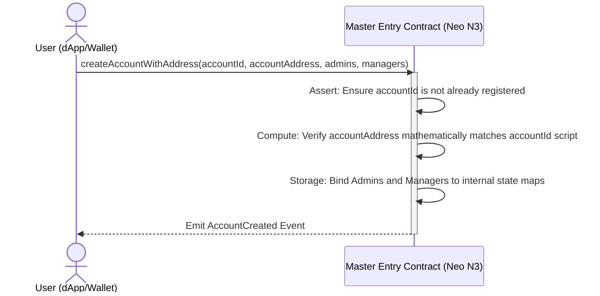
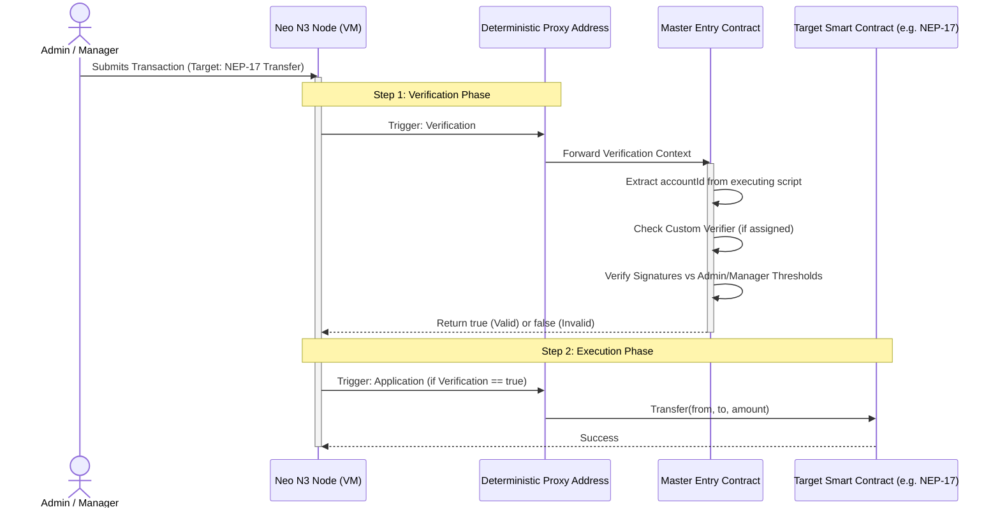
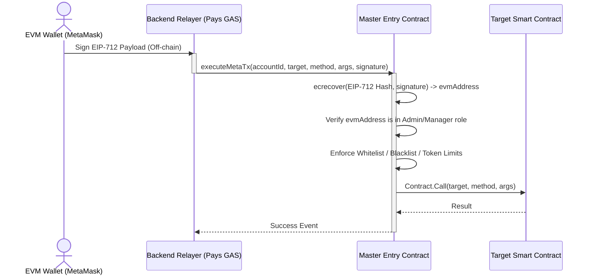

# Abstract Account Workflow Lifecycle

The workflow of the Neo N3 Abstract Account mimics the intended behavior of Ethereum's ERC-4337, translating generalized intents into validated on-chain operations using a Master Entry Proxy.

## 1. Account Initialization

No code needs to be deployed by a user. The user simply dictates an initialization payload to the global `Master Entry Contract`.

## 2. Standard Native Invocation

When a user wants to execute a transaction natively through the Neo N3 consensus nodes, the node intercepts the signature verification of the Proxy Address and invokes the Master Contract.

## 3. Meta-Transaction (Gasless / EVM) Workflow

Users without native Neo GAS can sign an EIP-712 formatted message via MetaMask. A relayer covers the Neo network fees and executes the payload on their behalf.

