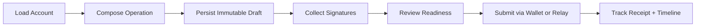
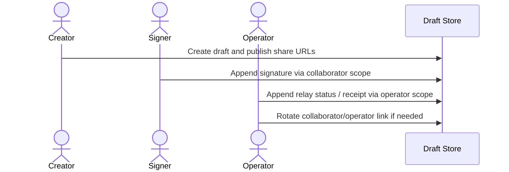
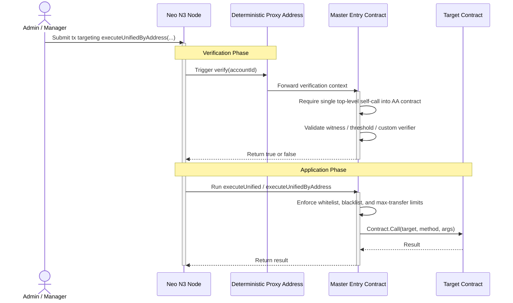
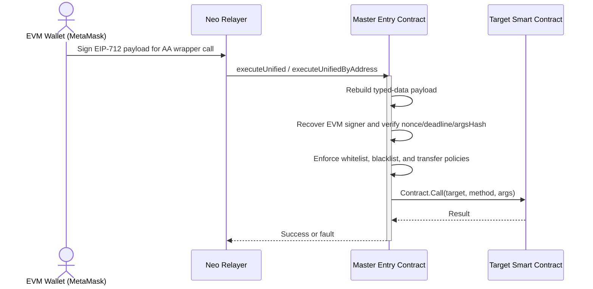

# Abstract Account Workflow Lifecycle

The Neo N3 Abstract Account workflow turns user intent into verified on-chain execution through the master contract. After the March 6, 2026 hardening update, deterministic proxy witnesses are only valid for a single top-level self-call back into the Abstract Account contract. That means direct proxy-signed external token transfers are rejected, while the canonical runtime entrypoints `executeUnified` and `executeUnifiedByAddress` are the supported application paths.

## Home Operations Workspace

The home operations workspace is now the fastest path for day-to-day usage. It lets a user load an Abstract Account by AA address or `.matrix` domain, stage the AA wrapper invocation, persist an immutable share draft, collect mixed Neo + EVM approvals, and then choose the final submission path. For client-side Neo execution, the workspace now stages a concrete `executeUnifiedByAddress` runtime call against the AA contract instead of pointing the wallet directly at the downstream target contract.

For v1, both broadcast modes are supported:

- **Client-side broadcast:** safest default path; a connected Neo browser wallet signs and submits the invocation directly.
- **Relay broadcast:** optional path for either already-signed raw transactions or relay-ready `executeUnifiedByAddress` invocations assembled from collected EVM signatures. When a relayer signer is configured, the server can submit those meta invocations without requiring users to reconstruct the call body manually.

Anonymous collaboration drafts can be backed by Supabase. The public share link carries only the opaque read slug, a collaborator link carries signature-collection authority, and a separate operator link carries relay, broadcast, and draft-management authority. Signer links also cannot forge relay or broadcast timeline entries; those activity classes are reserved for operator scope. That keeps ordinary shared links read-only while still preserving the cheap anonymous collaboration flow. If either write-capable URL leaks, the workspace can rotate the collaborator or operator link in place without rebuilding the draft.

To keep shared drafts lightweight over time, the frontend now retains only the latest 100 activity entries and the latest 12 submission receipts in draft metadata. That bounded-retention policy is applied consistently in both the local browser fallback and the Supabase-backed shared draft path.

If Supabase is not configured, the workspace falls back to a local-only draft store backed by `localStorage`. That keeps the compose → persist → sign → review flow working in the same browser, but those share links are intentionally local-only and are not a substitute for the real anonymous Supabase collaboration path.

The composer ships with concrete presets for **Generic Invoke**, **NEP-17 Transfer**, and **Multisig Draft** flows so users can stage common AA operations without hand-writing every JSON argument from scratch.

If you want the UI to treat collected EVM meta signatures as directly relayable, expose `VITE_AA_RELAY_META_ENABLED=1` alongside the server-side `AA_RELAY_WIF` configuration. That lets the workspace show an accurate relay-readiness state before submission. When both a signed raw transaction and a relay-ready meta invocation exist, the UI now offers explicit **Best Available**, **Signed Raw Tx**, and **Meta Invocation** choices so operators can control which relay path is used. The **Check Relay** action runs a server-backed preflight simulation for relay-ready meta invocations before submission and clearly reports when signed raw transaction simulation is not supported. The dedicated **Relay Preflight** panel then shows the selected payload mode, simulated VM state, gas estimate, operation, any exception details, and an expandable **Stack Preview** for inspecting return values. Stack items are also decoded for common VM types such as `Integer`, `Boolean`, `ByteString`, and nested `Array` values. Operators can also use **Copy Payload**, **Copy Stack**, and **Export JSON** actions directly from that panel for handoff and debugging.

## 1. First Transaction Walkthrough

For a first successful transaction, the recommended sequence is:

1. **Load the account** — enter the AA address or derive it from the expected identity path.
2. **Choose the operation** — start with a preset like Generic Invoke or NEP-17 Transfer.
3. **Persist the draft** — lock in the body before collecting external signatures.
4. **Collect signatures** — native Neo, EVM typed-data, or both depending on threshold requirements.
5. **Review readiness** — confirm signer progress, relay mode, and explorer settings.
6. **Choose submission path** — client-side wallet broadcast or relay-backed submission.
7. **Monitor the receipt** — txid, result, timeline entry, and follow-up actions.

## 2. Choose the Submission Path

Use this rule of thumb:

| Path | Best for | Requirements | Tradeoff |
| --- | --- | --- | --- |
| Client-side broadcast | Native Neo wallet users | Browser wallet connected | Simplest and most transparent |
| Relay preflight only | Operators who want simulation before submit | Relay endpoint configured | Adds server dependency, but gives VM/gas feedback |
| Relay raw submission | Existing signed raw transaction | Raw forwarding explicitly enabled | Only use when you intentionally want passthrough |
| Relay meta submission | EVM signature collection flow | Relay signer + relay meta mode configured | Most flexible for mixed-signature workflows |

## 3. Collaboration Lifecycle

The collaboration lifecycle exists so different people can contribute without sharing the same power level.

## 4. Standard Native Invocation

Native Neo execution now flows through Abstract Account wrapper methods instead of relying on a raw proxy witness to call an external contract directly.

> Raw external contract calls signed only by the deterministic proxy are intentionally rejected after hardening.

## 5. Meta-Transaction Workflow

Ethereum users can still sign EIP-712 payloads off-chain while a Neo relayer pays network fees and submits the wrapped AA execution.

## 6. Before You Broadcast

Before a production submission, operators should verify:

- the draft body matches the intended target and method
- signer progress satisfies the configured threshold
- the chosen payload mode is the one you actually want to send
- relay readiness is green if using relay submission
- explorer base URL is set if you want receipt links
- collaborator/operator links are rotated if an older scoped URL leaked

## 7. If Something Fails

Use the failure mode to decide where to look next:

- **Wallet connect issue** — browser wallet integration or missing provider
- **Signature count incomplete** — draft collaboration or threshold mismatch
- **Relay readiness warning** — runtime config mismatch or unsupported payload mode
- **Simulation fault** — contract policy or target-call failure
- **Broadcast failure** — network fee, RPC, or signer-side submission problem

## Matrix Domain Discovery

If a user enters a `.matrix` domain instead of an AA address, the frontend resolves the domain to the controlling wallet address and then queries the AA contract for bound AA addresses where that wallet appears as an admin or manager. If exactly one AA is found, the workspace loads it automatically; if multiple are found, the user can choose which AA to open.
